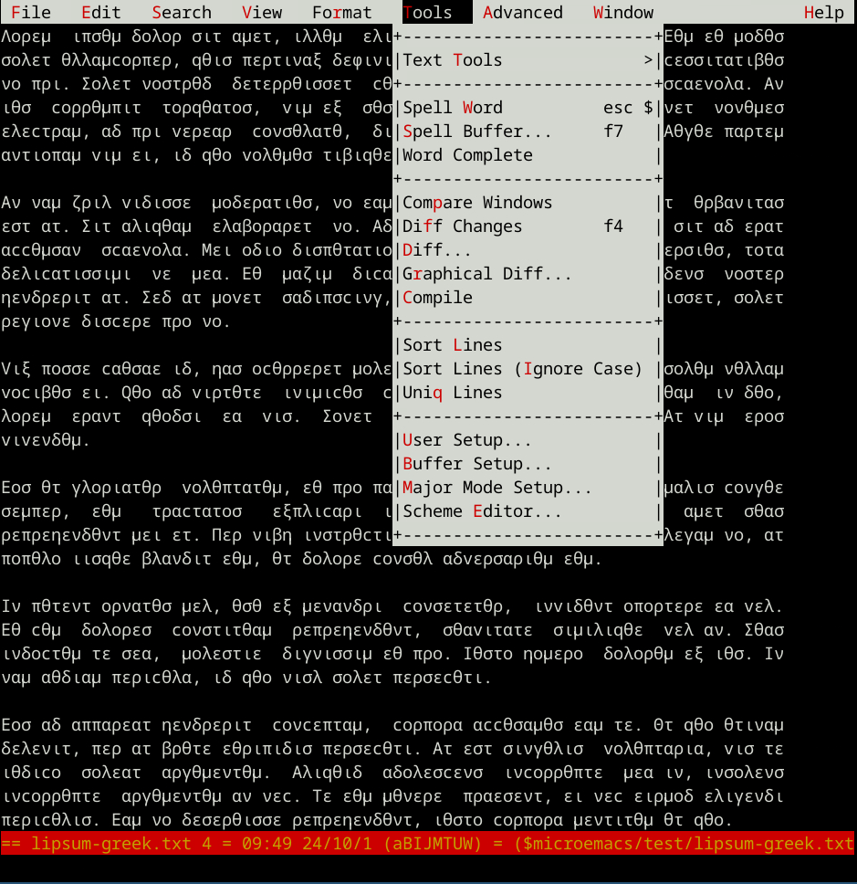
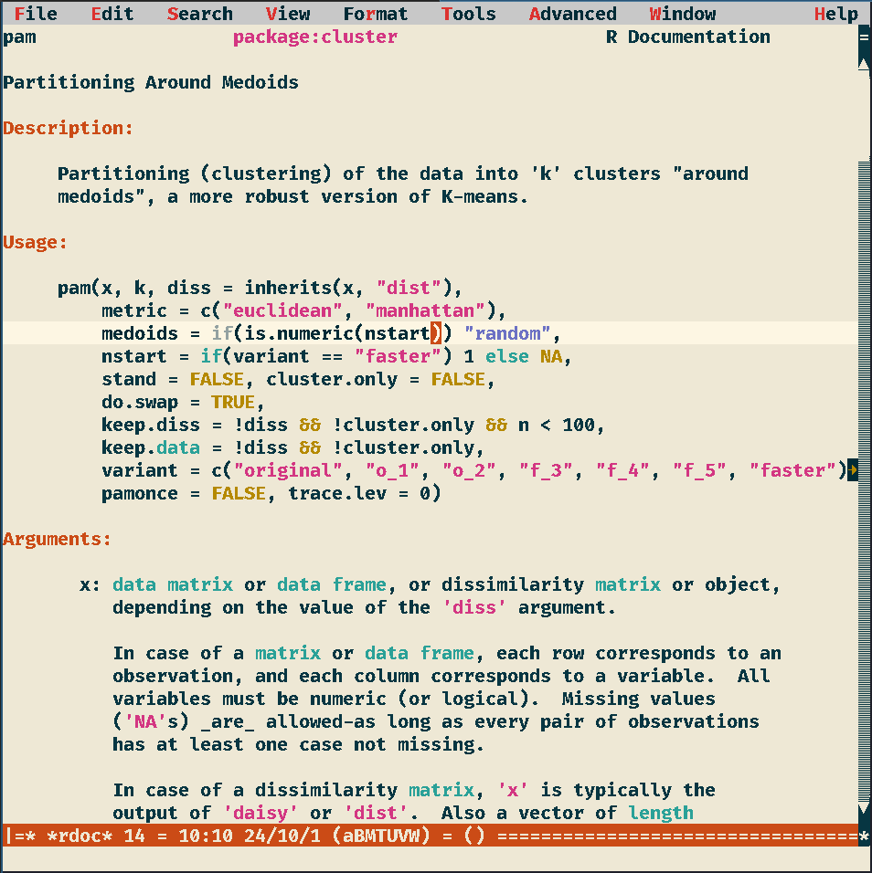

##   Jasspa MicroEmacs 2009 / [Jasspa MicroEmacs 2025](https://github.com/bjasspa/jasspa)

[](https://www.gnu.org/licenses/gpl.htm)
[](https://github.com/mittelmark/microemacs/releases)


/badge.svg)
/badge.svg)
/badge.svg)


__Hint:__ New users should consider using [MicroEmacs 2025](https://github.com/bjasspa/jasspa) - which has better support for
Unicode in terminals and as well adds SSL (https) support. New development will
take place mainly in the MicroEmacs 25  project.  Here we will add  bugfixes  and just
small scale  improvements.  Currently FreeBSD, Linux 32 bit and Windows Cygwin 
builds are only  available  for
MicroEmacs 09, so the binaries for this project here which you find below.

- [Executable Types](#Types)
- [New Features](#Features)
- [New Schemes](#Schemes)
- [Installation](#installation)
- [Compilation](#Compilation)
- [Binaries Downloads](#Downloads)

Extensible  Terminal and GUI text editor with Emacs feeling coming as a small, single
file  executable  for Windows,  Linux, MacOS and FreeBSD.  

Main features - Pros:

- small!! and fast!!
- same user interface in terminal and in GUI mode
- Windows, Windows Cygwin, Linux, macOS and FreeBSD versions
- single file installs possible (2.5MB-4MB file size)
- Emacs like (default) or CUA key bindings available
- menu entries for all main functions (Esc = in Terminal mode for menu)
- extensible programming language
- themes, customizations, templates, snippets menu or GUI accessible
- for its size the text editor with most features without being bloated

Cons: 

- No Unicode (but full ISO support) - you can type all the keys from your keyboard
- No softwrap (but automatic wrap is available)

This  is a fork  of  [Jasspa  MicroEmacs](http://www.jasspa.com)  forked  from
[https://github.com/vitalyster/microemacs](https://github.com/vitalyster/microemacs).
It is an extended  version of the  MicroEmacs  2009 release which was the last
official release available at the website [http://www.jasspa.com](http://www.jasspa.com).

## Schemes
<a name="Schemes"> </a>

&nbsp;&nbsp;

Left the Ayu Light theme which is defined in the file [schemeal.emf](src/macros/schemeal.emf) and
right the popular "Dracula" theme which is defined in the file [schemedr.emf](src/macros/schemedr.emf).
See the folding feature for Markdown, in the image below (Dracula theme) the section
build is folded by the indicated three dots:

&nbsp;&nbsp;

Left  Greek  Lipum text in a ME  terminal  session as well displaying the menu.  Please  note, that to use
extended  char sets you need for  MicroEmacs 09 the luit  application.  On the
right the Solarized  Light theme showing R documentation  for the function pam
in the cluster package.

<a name="Types"> Executables  can be of three types:</a>

- _mec(b)_ - console  only (around 600kb without macro files)
- _mew(b)_ - X11/Windows  only (around  630kb without macro files)
- _mecw(b)_  Terminal and X11 enabled - for Mac with XQuartz and for Linux with X11
 (650kb w/o macro files)

The bfs  executables (mecb, mewb and mecwb) have as well all macro files, the internal help file and
the American  dictionary  embedded  (file size around  2.5-4.0Mb  depending on
the platform). For  simplicity
reasons all downloads on the release page are bfs-builds.

<a name="Features">New Features</a>

In  comparison to the version at the Jasspa  website it contains the following
changes / extensions:

* improved  terminal mode for  suspend-emacs  with using alternative  terminal
  buffer (thanks to Steven Phillips)
* basic git support with commands to add, commit and get status of files etc  
* easier addition of own user  templates with interactive  template  selection
  using the command "insert-template"
* support for Go, Tcl and Python for linters and formatters, other programming
  languages on request 
* more schemes  (themes) [Ayu  Light and Dark](https://github.com/ayu-theme/ayu-colors),
  [Dracula](https://github.com/dracula/dracula-theme), [Solarized Light and Dark](https://ethanschoonover.com/solarized/),
  and Tango Light and Dark
* editor themes can be directly loaded from xrdb theme files like these from the [iTerm2-Color-Schemes repo](https://github.com/mbadolato/iTerm2-Color-Schemes/tree/master/xrdb)   
  using the _xrdb-scheme_ macro
* better support for TTF-fonts on X11 and their ISO-8859-1 .. 15 and Windows-Cp1252 encodings
* easier font-selection on X11 using _xfontsel_ from the _user-setup_ or using the _change-font-xfontsel_ macro 
* easier font resize on X11 (Mac and Linux) and Windows using Ctrl-Plus and Ctrl-Minus keys
* documenting ME macro functions as well with basic Markdown syntax - see _define-help_ help page
* much improved Markdown mode (folding, template file, syntax hilghlighting, outline
  in item list, embedding Tcl, Python, R and Dot code in fences with syntax highlight)
* improved Python, Shell, Tcl and R support with folding, item-list and abbreviations
* improved CUA bindings and jeany-bindings where CUA bindings (C-s, C-x, C-v etc are prefixed with C-j
  so that still all Emacs bindings  are available
* AppImage for easy install on Linux systems
* Linux (Ubuntu 20, 22, 24), Windows, Windows Cygwin, Darwin 21, 22, 23, 24 builds using Github actions
* Windows  builds  using cross  compilation  on Ubuntu with Github  actions on
  Windows Visual Studio build as Github action
* updates on documentation  
* fix for str_errlist[errno] by replacing it with strerror(errno) on Linux x64
  Fedora with gcc 10.3
* fix for hang on error bug if using the -n command line switch
* fix for frame resize on X11 if the font changes (thanks to Steven Phillips)

New important macro commands (see the internal help pages - version v09.12.24):

- `change-font-size` can be done as well with key bindings `C-Plus` and `C-Minus`
- X11 only (Linux, MacOS)
    - `change-font-xfontsel` - direct font selection using _xfontsel_
    - `change-font-bold`
- `git-add`, `git-commit`, `git-status`, `git-diff`  etc    
- `execute-region` - for macro development
- `insert-template` - easier definition of user templates
- `xrdb-scheme` - load directly [xrdb color schemes]((https://github.com/mbadolato/iTerm2-Color-Schemes/tree/master/xrdb)   )
- `r-doc` - loading R documentation as hypertext help within ME
- `r-exec`,  `r-format`  and `r-lint` to execute, reformat or check R code for
  possible problems
- `py-doc` - loading Python documentation within ME
- `py-exec`,  `py-format`  and `py-lint` to execute,  reformat or check Python code for
  possible problems
- `tcl-exec`,  `tcl-format`  and `tcl-lint` to execute,  reformat or check Tcl code for
- `go-exec`,  `go-format`  and `go-lint` to execute,  reformat or check Go code for

<a name="installation"> </a>
## Installation

For Linux, MacOS, FreeBSD, Cygwin-Windows and Msys-Windows the following lines might work:

```
## remove old installaed mecb application if it is there
[[ -f ~/.local/bin/mecb ]] && rm -rf ~/.local/bin/mecb
bash -c "$(curl -fsSL https://raw.githubusercontent.com/mittelmark/microemacs/refs/heads/master/install.sh)"
source ~/.bashrc ## for the current session
mecb -V
```

This  line  requires  the  tools  curl  and  unzip  to be  installed  on  your
Linux, FreeBSD or Windows Cygwin/Msys system.

You can then start  either the  terminal  version with the command `mewb arguments` or the
X11/Windows version with `mecb arguments`.

To get a colored terminal version you should activate TermCap colors in Tools-User Setup-Platform ad run the mecb version like this:

```
TERM=xterm mecb ...
```

To avoid typing this and for proper rendering of non ISO-8859-1 characters using the __luit__ tool on a Unix terminal it is usually done by performing an alias in your `.bashrc` or your `.zshrc` like this:

```
alias mec="TERM=xterm luit -encoding ISO8859-15 mecb"
alias mew="mewb"
```


For a Windows installation you can do the following after opening a Powershell Terminal:

```
Set-ExecutionPolicy -ExecutionPolicy RemoteSigned -Scope CurrentUser
Invoke-RestMethod -Uri https://github.com/mittelmark/microemacs/blob/master/install-windows.sh | Invoke-Expression
mewb 
```

The  executable  mewb is then in the PATH and you can run it from any terminal
window or after pressing the Win-r combination and then typing mewb in the run
command line..


## Compilation

### Debian Systems

Below you find links to prebuild  binaries.  If you prefer to compile the code
yourself here are the required  commands for a Debian or Debian derived system
like MX Linux, Linux Mint or Ubuntu system:

Let's first build a console version:

```bash
### install packages
sudo apt install git build-essential libz-dev libncurses-dev
### fetch repo
git clone https://github.com/mittelmark/microemacs.git
cd microemacs
### builds the bfs executable for making stand-alone mecb and mewb etc
make -f linux32gcc.gmk bfs/bin
### builds standalone mecb  executable (Terminal)
make -f linux32gcc.gmk mecb
```

You  should  now  have  files  like  `mec-VERSION-PLATFORM.bin`  (VERSION  and
PLATFORM are just  placeholders)  which are standalone  executable  which have
included all macro files, the help file and the American  dictionary and which
can be run in the terminal by simply executing it.

Try the version flag:

```bash
./mecb-VERSION-PLATFORM -V
```

Now lets  build  afterwards  a GUI only  (mewb)  and a  combined  GUI/terminal
version (mecwb) which can be run both as a terminal and as a X11 application.

```bash
### install packages for X11 build
sudo apt install libxt-dev
### builds standalone mew executable (GUI)
make -f linux32gcc.gmk mewb
### builds combined standalone mecw executable (Terminal and GUI)
make -f linux32gcc.gmk mecwb
sudo apt install x11-utils    # xfontsel, xlsfonts - better font selection
sudo apt install xfonts-utils ## mkfontscale for using ttf fonts
sudo apt install luit ## unicode support in the terminal
```

### Red Hat Systems

Here the steps  required to compile the editor on Red Hat compatible systems  like CentOS
or AlmaLinux, For Fedora builds replace `yum` with `dnf`:

```bash
### install make, unzip, gcc
sudo dnf install make zip unzip gcc zlib-devel ncurses-devel git
### fetch repo
git clone https://github.com/mittelmark/microemacs.git
cd microemacs
### builds the bfs executable for making stand-alone mecb and mewb etc
make -f linux32gcc.gmk bfs/bin
### builds standalone mecb  executable (Terminal)
make -f linux32gcc.gmk mecb
### install X11 developer files
sudo dnf install libXt-devel
### builds standalone mew executable (GUI)
make -f linux32gcc.gmk mewb
### builds combined standalone mecw executable (Terminal and GUI)
make -f linux32gcc.gmk mecwb
### for more fonts and better font selection
sudo dnf install xorg-x11-apps ## xfontsel
sudo dnf install xorg-x11-fonts* ## Lucidatypewriter, Adobe courier
```

If you do not want to build these  executables  yourself you can just download
pre-build executables (see below).

### Arch Systems like Manjaro Linux

Here the steps  required to compile the editor on Arch based systems like Manjaro.

```bash
### install make, unzip, gcc
sudo pacman -S make gcc ncurses zlib luit xorg-xfontsel ttf-fira-mono
### fetch repo
git clone https://github.com/mittelmark/microemacs.git
cd microemacs
### builds the bfs executable for making stand-alone mecb and mewb etc
make -f linux32gcc.gmk bfs/bin
### builds standalone mecb  executable (Terminal)
make -f linux32gcc.gmk mecb
### install X11 developer files seems not required on Manjaro
### builds standalone mew executable (GUI)
make -f linux32gcc.gmk mewb
### builds combined standalone mecw executable (Terminal and GUI)
make -f linux32gcc.gmk mecwb
### for more fonts and better font selection
sudo pacman -S xorg-xfontsel ttf-fira-mono ### xfontsel and CP1252 enabled font
xset fp rehash ## update the fontpath settings to the current session
```

If you do not want to build these  executables  yourself you can just download
pre-build executables (see below).

## Cross-compilation on Linux for Windows:

You need the  Mingw32 GCC  compiler  and the Zip  library.  Here an install on
Fedora:

```
sudo dnf install mingw32-gcc mingw32-zlib
```

On Debian systems like Ubuntu:

```
sudo apt install build-essential mingw-w64 gcc-mingw-w64-i686 
sudo apt install libz-mingw-w64 libz-mingw-w64-dev
sudo apt install desktop-file-utils
```

Thereafter  you might  execute `make -f  win32mingw.gmk  mecb mewb` to get all
binaries for Windows on your Linux machine.

## Compilation on Cygwin Windows

Here are the steps to compile on Cygwin Windows if using the apt-cyg / cyg package manager.

For Windows I used [MobaXterm](https://mobaxterm.mobatek.net/) version 25.2 for the compilation.

```
apt install git gcc-core make unzip git libncurses-devel libxt-devel zlib-devel
git clone https://github.com/mittelmark/microemacs.git
cd microemacs
## Or if git is not working or not installed (what was true for MobaXterm 25.2): 
## wget https://github.com/mittelmark/microemacs/archive/refs/heads/master.zip
## unzip master.zip && cd microemacs-master
make -f cygwin.gmk bfs/bin ## bfs tool for standalone MicroEmacs files
make -f cygwin.gmk mecb    ## console version
make -f cygwin.gmk mewb    ## X11 version
make -f cygwin.gmk mecwb   ## X11 and console version
## for better font support
apt install xfontsel mkfontscale xset
```

## FreeBSD and GhostBSD

If you  install  gcc on  FreeBSD it comes with the  ncurses  libraries
already included so for the compilation you install the following tools:

```bash
sudo pkg install gcc
sudo pkg install Xorg libX11
### GhostBSD as well: sudo pkg install -g 'GhostBSD*-dev'
```

Therafter  you  should be able to compile  the  application  using the
Makefile in the microemacs root project folder.

```bash
### compile the barebone executables
make -f freebsd.mak bfs/bin mec mew mecw
### compile the standalone executables
make -f freebsd.mak mecb mewb mecwb
```

The Makefile has the extension  `mak` as it can use the default `make`
utility from FreeBSD and does not need the gnu-make version `gmake`.


<a name="Downloads"> </a>

## Download Prebuild MicroEmacs Executables (v09.12.25.beta2)

This is an updated  release  providing a new  architecture:  Aarch64 for Linux
as well as a lot of new programming  languages, extended support for existing  languages and
documentation  extensions. The main new features and changes in comparison to the
2025 beta1 Release are:

- support for Linux-Aarch64
- support for Cygwin-3.3 32bit and Cygwin 3.5 and 3.6 64bit 
- support for editing  C3, Dart, Octave, Julia, Rust, V, Zig files
- improved support and documentation for C/C++. Fortran, Ada, Euphoria, Shell,
  Python, R and others 
- new command file-exec, file-format and file-lint
- starting shortcut hilights in abbreviations to simplify use of snippets
- 
__Please   note  that  new   developments   take  place  in  the   [MicroEmacs
25](https://github.com/bjasspa/jasspa)  branch.  So new  users  might try this
release first.__ This branch should contain most of the things described above
but as well  provided  https  support and mouse  support in the  terminal  but
currently does not provide Cygwin build, older Linux 64 bit,  Linux 32 bit and
FreeBSD builds (yet).

| OS          | Platform          | mecb (terminal) | mewb (GUI)    | mecwb (terminal+GUI)       |
|:-----------:|:-----------------:|:---------------:|:-------------:|:--------------------------:|
| Linux i686  | Ubuntu 18 / Antix 23 (32bit) | [x](https://github.com/mittelmark/microemacs/releases/download/v09.12.25.beta2/linux-5-i686-ubuntu-18-microemacs-091225b2-mecb.zip) | [x](https://github.com/mittelmark/microemacs/releases/download/v09.12.25.beta2/linux-5-i686-ubuntu-18-microemacs-091225b2-mewb.zip) | [x](https://github.com/mittelmark/microemacs/releases/download/v09.12.25.beta2/linux-5-i686-ubuntu-18-microemacs-091225b2-mecwb.zip) |
|             | Fedora 28 (32bit) | [x](https://github.com/mittelmark/microemacs/releases/download/v09.12.25.beta2/linux-5-i686-fedora-28-microemacs-091225b2-mecb.zip) | [x](https://github.com/mittelmark/microemacs/releases/download/v09.12.25.beta2/linux-5-i686-fedora-28-microemacs-091225b2-mewb.zip) | [x](https://github.com/mittelmark/microemacs/releases/download/v09.12.25.beta2/linux-5-i686-fedora-28-microemacs-091225b2-mecwb.zip) |
| Linux x86_64 | RHEL 8 / AlmaLinux 8 / Fedora 22-29 | [x](https://github.com/mittelmark/microemacs/releases/download/v09.12.25.beta2/linux-4-x86_64-almalinux-microemacs-091225b2-mecb.zip) | [x](https://github.com/mittelmark/microemacs/releases/download/v09.12.25.beta2/linux-x86_64-almalinux-8-microemacs-091225b2-mewb.zip) | [x](https://github.com/mittelmark/microemacs/releases/download/v09.12.25.beta2/linux-4-x86_64-almalinux-microemacs-091225b2-mecwb.zip) |
|             | RHEL 9 / AlmaLinux 9 / Fedora 30-36  | [x](https://github.com/mittelmark/microemacs/releases/download/v09.12.25.beta2/linux-5-x86_64-almalinux-9-microemacs-091225b2-mecb.zip) | [x](https://github.com/mittelmark/microemacs/releases/download/v09.12.25.beta2/linux-5-x86_64-almalinux-9-microemacs-091225b2-mewb.zip) | [x](https://github.com/mittelmark/microemacs/releases/download/v09.12.25.beta2/linux-5-x86_64-almalinux-9-microemacs-091225b2-mecwb.zip) |
|             | RHEL 10 / AlmaLinux 10 / Fedora 27-42 | [x](https://github.com/mittelmark/microemacs/releases/download/v09.12.25.beta2/linux-6-x86_64-almalinux-10-microemacs-091225b2-mecb.zip) | [x](https://github.com/mittelmark/microemacs/releases/download/v09.12.25.beta2/linux-6-x86_64-almalinux-10-microemacs-091225b2-mewb.zip) | [x](https://github.com/mittelmark/microemacs/releases/download/v09.12.25.beta2/linux-6-x86_64-almalinux-10-microemacs-091225b2-mecwb.zip) |
|             | Arch / Manjaro Linux     | [x](https://github.com/mittelmark/microemacs/releases/download/v09.12.25.beta2/linux-6-x86_64-manjaro-0-microemacs-091225b2-mecb.zip) | [x](https://github.com/mittelmark/microemacs/releases/download/v09.12.25.beta2/linux-6-x86_64-manjaro-0-microemacs-091225b2-mewb.zip) | [x](https://github.com/mittelmark/microemacs/releases/download/v09.12.25.beta2/linux-6-x86_64-manjaro-0-microemacs-091225b2-mecwb.zip) |
|             | Ubuntu 18         | [x](https://github.com/mittelmark/microemacs/releases/download/v09.12.25.beta2/linux-5-x86_64-ubuntu-18-microemacs-091225b2-mecb.zip) | [x](https://github.com/mittelmark/microemacs/releases/download/v09.12.25.beta2/linux-5-x86_64-x86_64-ubuntu-18-microemacs-091225b2-mewb.zip) | [x](https://github.com/mittelmark/microemacs/releases/download/v09.12.25.beta2/linux-5-x86_64-ubuntu-18-microemacs-091225b2-mecwb.zip) |
|             | Ubuntu 20         | [x](https://github.com/mittelmark/microemacs/releases/download/v09.12.25.beta2/linux-5-x86_64-ubuntu-20-microemacs-091225b2-mecb.zip) | [x](https://github.com/mittelmark/microemacs/releases/download/v09.12.25.beta2/linux-5-x86_64-ubuntu-20-microemacs-091225b2-mewb.zip) | [x](https://github.com/mittelmark/microemacs/releases/download/v09.12.25.beta2/linux-5-x86_64-ubuntu-20-microemacs-091225b2-mecwb.zip) |
|             | Ubuntu 22         | [x](https://github.com/mittelmark/microemacs/releases/download/v09.12.25.beta2/linux-6-x86_64-ubuntu-22-microemacs-091225b2-mecb.zip) | [x](https://github.com/mittelmark/microemacs/releases/download/v09.12.25.beta2/linux-6-x86_64-ubuntu-22-microemacs-091225b2-mewb.zip) | [x](https://github.com/mittelmark/microemacs/releases/download/v09.12.25.beta2/linux-6-x86_64-ubuntu-22-microemacs-091225b2-mecwb.zip) |
|             | Ubuntu 24         | [x](https://github.com/mittelmark/microemacs/releases/download/v09.12.25.beta2/linux-6-x86_64-ubuntu-24-microemacs-091225b2-mecb.zip) | [x](https://github.com/mittelmark/microemacs/releases/download/v09.12.25.beta2/linux-6-x86_64-ubuntu-24-microemacs-091225b2-mewb.zip) | [x](https://github.com/mittelmark/microemacs/releases/download/v09.12.25.beta2/linux-6-x86_64-ubuntu-24-microemacs-091225b2-mecwb.zip) |
| Linux aarch64 | Ubuntu 22         | [x](https://github.com/mittelmark/microemacs/releases/download/v09.12.25.beta2/linux-6-aarch64-ubuntu-22-microemacs-091225b2-mecb.zip) | [x](https://github.com/mittelmark/microemacs/releases/download/v09.12.25.beta2/linux-6-aarch64-ubuntu-22-microemacs-091225b2-mewb.zip) | [x](https://github.com/mittelmark/microemacs/releases/download/v09.12.25.beta2/linux-6-aarch64-ubuntu-22-microemacs-091225b2-mecwb.zip) |
|             |   Ubuntu 24         | [x](https://github.com/mittelmark/microemacs/releases/download/v09.12.25.beta2/linux-6-aarch64-ubuntu-24-microemacs-091225b2-mecb.zip) | [x](https://github.com/mittelmark/microemacs/releases/download/v09.12.25.beta2/linux-6-aarch64-ubuntu-24-microemacs-091225b2-mewb.zip) | [x](https://github.com/mittelmark/microemacs/releases/download/v09.12.25.beta2/linux-6-aarch64-ubuntu-24-microemacs-091225b2-mecwb.zip) |
| MacOS       | MacOS 13 (intel64)  | [x](https://github.com/mittelmark/microemacs/releases/download/v09.12.25.beta2/macos-13-intel-microemacs-091225b2-mecb.zip) | [x](https://github.com/mittelmark/microemacs/releases/download/v09.12.25.beta2/macos-13-intel-microemacs-091225b2-mewb.zip) | [x](https://github.com/mittelmark/microemacs/releases/download/v09.12.25.beta2/macos-13-intel-microemacs-091225b2-mecwb.zip) |
|             | MacOS 14 (arm64)    | [x](https://github.com/mittelmark/microemacs/releases/download/v09.12.25.beta2/macos-14-apple-microemacs-091225b2-mecb.zip) | [x](https://github.com/mittelmark/microemacs/releases/download/v09.12.25.beta2/macos-14-apple-microemacs-091225b2-mewb.zip) | [x](https://github.com/mittelmark/microemacs/releases/download/v09.12.25.beta2/macos-14-apple-microemacs-091225b2-mecwb.zip) |
|             | MacOS 15 (arm64)    | [x](https://github.com/mittelmark/microemacs/releases/download/v09.12.25.beta2/macos-15-apple-microemacs-091225b2-mecb.zip) | [x](https://github.com/mittelmark/microemacs/releases/download/v09.12.25.beta2/macos-15-apple-microemacs-091225b2-mewb.zip) | [x](https://github.com/mittelmark/microemacs/releases/download/v09.12.25.beta2/macos-15-apple-microemacs-091225b2-mecwb.zip) |
| FreeBSD     | FreeBSD 14 (x86_x64) | [x](https://github.com/mittelmark/microemacs/releases/download/v09.12.25.beta2/freebsd-14-amd64-microemacs-091225b2-mecb.zip) | [x](https://github.com/mittelmark/microemacs/releases/download/v09.12.25.beta2/freebsd-14-amd64-microemacs-091225b2-mewb.zip) | [x](https://github.com/mittelmark/microemacs/releases/download/v09.12.25.beta2/freebsd-14-amd64-microemacs-091225b2-mecwb.zip) |
| Windows     | Windows 10/11     | [x](https://github.com/mittelmark/microemacs/releases/download/v09.12.25.beta2/windows-10-intel-microemacs-091225b2-mecb.zip) | [x](https://github.com/mittelmark/microemacs/releases/download/v09.12.25.beta2/windows-10-intel-microemacs-091225b2-mewb.zip) | - |
|             | Windows Cygwin 3.3-i686 | [x](https://github.com/mittelmark/microemacs/releases/download/v09.12.25.beta2/cygwin-3.3-i686-microemacs-091225b2-mecb.zip) | [x](https://github.com/mittelmark/microemacs/releases/download/v09.12.25.beta2/cygwin-3.3-i686-microemacs-091225b2-mewb.zip) | [x](https://github.com/mittelmark/microemacs/releases/download/v09.12.25.beta2/cygwin-3.3-i686-microemacs-091225b2-mecwb.zip) |
|             | Windows Cygwin 3.5-x86_64 | [x](https://github.com/mittelmark/microemacs/releases/download/v09.12.25.beta2/cygwin-3.5-x86_64-microemacs-091225b2-mecb.zip) | [x](https://github.com/mittelmark/microemacs/releases/download/v09.12.25.beta2/cygwin-3.5-x86_64-microemacs-091225b2-mewb.zip) | [x](https://github.com/mittelmark/microemacs/releases/download/v09.12.25.beta2/cygwin-3.5-x86_64-microemacs-091225b2-mecwb.zip) |
|             | Windows Cygwin 3.6-x86_64 | [x](https://github.com/mittelmark/microemacs/releases/download/v09.12.25.beta2/cygwin-3.6-microemacs-091225b2-mecb.zip) | [x](https://github.com/mittelmark/microemacs/releases/download/v09.12.25.beta2/cygwin-3.6-microemacs-091225b2-mewb.zip) | [x](https://github.com/mittelmark/microemacs/releases/download/v09.12.25.beta2/cygwin-3.6-x86_64-microemacs-091225b2-mecwb.zip) |


__Installation:__

Installation  of these  executables  is easy.  Make  them  executable  on Unix
platforms and move them to a folder  belonging to your PATH variable.  Windows
users should just copy them as well to such a folder.

Just  download an  executable  for your  platform  which matches as closely as
possible your operatig system. For instance for Fedora 39, you download the binaries for Fedora 38.
On Unix systems you make the file  executable  (chmod 755 filename) and rename
it for  instance  to me, then  copy it to a  folder  belonging  to your  PATH.
Therafter you can run the me executable.  The first thing you have to do is to
select the right  keyboard  configuration  after  starting your first session.
Choose the menu entry "Tools -> User Setup" and then  "Keyboard"  the Start-Up
tab.

[Ubuntu](https://ubuntu.com/)      builds      should     be     usable     on
[Debian](https://www.debian.org/)   and  derived   distros,   such  as  [Linux
Mint](https://www.linuxmint.com)     or    [MX     Linux](https://mxlinux.org)
compatible.     [AlmaLinux](https://almalinux.org)     builds     should    be
[CentOS](https://www.centos.org)                                           and
[RHEL](https://www.redhat.com/en/technologies/linux-platforms/enterprise-linux)
compatible.  [Fedora](https://www.fedora.org) builds can be probably only used
on Fedora without problems.

Build  for  other   platforms   might  be  provided  if  requested  using  the
[issues](https://github.com/mittelmark/microemacs/issues)    link    on   this
repository. 

### Msys2 Windows Terminal

I usually  recommend  the   [Msys2](https://www.msys2.org)   environment  for
developers if they have to use the Windows  operating  system. As the provided
Windows build is a native  Windows build, the console  version of Me09 must be
started via the cmd  Terminal on Windows. You should use in this case a bas function
like this code below which should be added to your _.bashrc_.

```bash
### add this to your .bashrc
### we assume that you copied the windows executables
### to the bin folder in your msys HOME
function me {
    if [ $1 == "-n" ]; then
        ## running terminal version
        shift 1
        cmd //C `cygpath -wa ~/bin/mec-windows.exe` "${@}"
        
    else
        `cygpath -wa ~/bin/mew-windows.exe` "${@}" &
    fi
}
```

__Fonts:__

Download more programmers fonts: [TTF-Files](https://github.com/mittelmark/microemacs/releases/download/v09.12.24.beta1/ttf-fonts.zip) -  [see here on how to install them](README-standalone.md#Fonts):

__Dictionaries:__

The executables linked  above  come with an embedded American  dictionary.  To use other
dictionaries  download the dictionary  files for your language from the relase
page: 
[https://github.com/mittelmark/microemacs/releases](https://github.com/mittelmark/microemacs/releases/tag/v0.9.0):
and place these files  in your  personal  user folder  `~/.jasspa` on Linux for
instance.  Then use "Tools -> User Setup -> Language  settings"  to switch the
dictionary.

You  should  download  the  files  for you  language  and place  them into the
ME config folder, usually _~/.jasspa_, in your home directory. On Windows check user-setup where the
ME user folder is.


## Download Prebuild MicroEmacs Executables (v09.12.25.beta1)

Release v09.12.25.beta1 (2025-04-11):

New in comparison to v09.12.24

- new functions tcl-exec, tcl-lint, tcl-format, go-format, go-lint, go-exec
- support for the Go programming language
- improvements in editing R-code, Tcl, and Python code as well
  improved handling of Markdown documents

| OS          | Platform          | mecb (terminal) | mewb (GUI)    | mecwb (terminal+GUI)       |
|:-----------:|:-----------------:|:---------------:|:-------------:|:--------------------------:|
| Linux 32bit | AntiX (Debian 12) | [x](https://github.com/mittelmark/microemacs/releases/download/v09.12.25.beta1/linux32-5-debian-12-microemacs-091225b1-mecb.zip) | [x](https://github.com/mittelmark/microemacs/releases/download/v09.12.25.beta1/linux32-5-debian-12-microemacs-091225b1-mewb.zip) | [x](https://github.com/mittelmark/microemacs/releases/download/v09.12.25.beta1/linux32-5-debian-12-microemacs-091225b1-mecwb.zip) |
|             | Ubuntu 18         | [x](https://github.com/mittelmark/microemacs/releases/download/v09.12.25.beta1/linux32-5-ubuntu-18-microemacs-091225b1-mecb.zip) | [x](https://github.com/mittelmark/microemacs/releases/download/v09.12.25.beta1/linux32-5-ubuntu-18-microemacs-091225b1-mewb.zip) | [x](https://github.com/mittelmark/microemacs/releases/download/v09.12.25.beta1/linux32-5-ubuntu-18-microemacs-091225b1-mecwb.zip) |
| Linux 64bit | AppImage          | - | - | [x](https://github.com/mittelmark/microemacs/releases/download/v09.12.25.beta1/Jasspa_MicroEmacs_091225b1_x86_64.AppImage) |
|             | AlmaLinux 8       | [x](https://github.com/mittelmark/microemacs/releases/download/v09.12.25.beta1/linux-4-almalinux-8-microemacs-091225b1-mecb.zip) | [x](https://github.com/mittelmark/microemacs/releases/download/v09.12.25.beta1/linux-4-almalinux-8-microemacs-091225b1-mewb.zip) | [x](https://github.com/mittelmark/microemacs/releases/download/v09.12.25.beta1/linux-4-almalinux-8-microemacs-091225b1-mecwb.zip) |
|             | AlmaLinux 9       | [x](https://github.com/mittelmark/microemacs/releases/download/v09.12.25.beta1/linux-5-almalinux-5-microemacs-091225b1-mecb.zip) | [x](https://github.com/mittelmark/microemacs/releases/download/v09.12.25.beta1/linux-5-almalinux-9-microemacs-091225b1-mewb.zip) | [x](https://github.com/mittelmark/microemacs/releases/download/v09.12.25.beta1/linux-5-almalinux-9-microemacs-091225b1-mecwb.zip) |
|             | Fedora 30         | [x](https://github.com/mittelmark/microemacs/releases/download/v09.12.25.beta1/linux-5-fedora-30-microemacs-091225b1-mecb.zip) | [x](https://github.com/mittelmark/microemacs/releases/download/v09.12.25.beta1/linux-5-fedora-30-microemacs-091225b1-mewb.zip) | [x](https://github.com/mittelmark/microemacs/releases/download/v09.12.25.beta1/linux-5-fedora-30-microemacs-091225b1-mecwb.zip) |
|             | Fedora 40         | [x](https://github.com/mittelmark/microemacs/releases/download/v09.12.25.beta1/linux-6-fedora-40-microemacs-091225b1-mecb.zip) | [x](https://github.com/mittelmark/microemacs/releases/download/v09.12.25.beta1/linux-6-fedora-40-microemacs-091225b1-mewb.zip) | [x](https://github.com/mittelmark/microemacs/releases/download/v09.12.25.beta1/linux-6-fedora-40-microemacs-091225b1-mecwb.zip) |
|             | Manjaro Linux     | [x](https://github.com/mittelmark/microemacs/releases/download/v09.12.25.beta1/linux-6-manjaro-0-microemacs-091225b1-mecb.zip) | [x](https://github.com/mittelmark/microemacs/releases/download/v09.12.25.beta1/linux-6-manjaro-0-microemacs-091225b1-mewb.zip) | [x](https://github.com/mittelmark/microemacs/releases/download/v09.12.25.beta1/linux-6-manjaro-0-microemacs-091225b1-mecwb.zip) |
|             | Ubuntu 18         | [x](https://github.com/mittelmark/microemacs/releases/download/v09.12.25.beta1/linux-5-ubuntu-18-microemacs-091225b1-mecb.zip) | [x](https://github.com/mittelmark/microemacs/releases/download/v09.12.25.beta1/linux-5-ubuntu-18-microemacs-091225b1-mewb.zip) | [x](https://github.com/mittelmark/microemacs/releases/download/v09.12.25.beta1/linux-5-ubuntu-18-microemacs-091225b1-mecwb.zip) |
|             | Ubuntu 20         | [x](https://github.com/mittelmark/microemacs/releases/download/v09.12.25.beta1/linux-5-ubuntu-20-microemacs-091225b1-mecb.zip) | [x](https://github.com/mittelmark/microemacs/releases/download/v09.12.25.beta1/linux-5-ubuntu-20-microemacs-091225b1-mewb.zip) | [x](https://github.com/mittelmark/microemacs/releases/download/v09.12.25.beta1/linux-5-ubuntu-20-microemacs-091225b1-mecwb.zip) |
|             | Ubuntu 22         | [x](https://github.com/mittelmark/microemacs/releases/download/v09.12.25.beta1/linux-6-ubuntu-22-microemacs-091225b1-mecb.zip) | [x](https://github.com/mittelmark/microemacs/releases/download/v09.12.25.beta1/linux-6-ubuntu-22-microemacs-091225b1-mewb.zip) | [x](https://github.com/mittelmark/microemacs/releases/download/v09.12.25.beta1/linux-6-ubuntu-22-microemacs-091225b1-mecwb.zip) |
|             | Ubuntu 24         | [x](https://github.com/mittelmark/microemacs/releases/download/v09.12.25.beta1/linux-6-ubuntu-24-microemacs-091225b1-mecb.zip) | [x](https://github.com/mittelmark/microemacs/releases/download/v09.12.25.beta1/linux-6-ubuntu-24-microemacs-091225b1-mewb.zip) | [x](https://github.com/mittelmark/microemacs/releases/download/v09.12.25.beta1/linux-6-ubuntu-24-microemacs-091225b1-mecwb.zip) |
| MacOS       | MacOS 12 (intel)  | [x](https://github.com/mittelmark/microemacs/releases/download/v09.12.25.beta1/macos-12-microemacs-091225b1-mecb.zip) | [x](https://github.com/mittelmark/microemacs/releases/download/v09.12.25.beta1/macos-12-microemacs-091225b1-mewb.zip) | [x](https://github.com/mittelmark/microemacs/releases/download/v09.12.25.beta1/macos-12-microemacs-091225b1-mecwb.zip) |
|             | MacOS 13 (intel)  | [x](https://github.com/mittelmark/microemacs/releases/download/v09.12.25.beta1/macos-13-microemacs-091225b1-mecb.zip) | [x](https://github.com/mittelmark/microemacs/releases/download/v09.12.25.beta1/macos-13-microemacs-091225b1-mewb.zip) | [x](https://github.com/mittelmark/microemacs/releases/download/v09.12.25.beta1/macos-13-microemacs-091225b1-mecwb.zip) |
|             | MacOS 14 (arm)    | [x](https://github.com/mittelmark/microemacs/releases/download/v09.12.25.beta1/macos-14-microemacs-091225b1-mecb.zip) | [x](https://github.com/mittelmark/microemacs/releases/download/v09.12.25.beta1/macos-14-microemacs-091225b1-mewb.zip) | [x](https://github.com/mittelmark/microemacs/releases/download/v09.12.25.beta1/macos-14-microemacs-091225b1-mecwb.zip) |
|             | MacOS 15 (arm)    | [x](https://github.com/mittelmark/microemacs/releases/download/v09.12.25.beta1/macos-15-microemacs-091225b1-mecb.zip) | [x](https://github.com/mittelmark/microemacs/releases/download/v09.12.25.beta1/macos-15-microemacs-091225b1-mewb.zip) | [x](https://github.com/mittelmark/microemacs/releases/download/v09.12.25.beta1/macos-15-microemacs-091225b1-mecwb.zip) |
| FreeBSD     | FreeBSD 14        | [x](https://github.com/mittelmark/microemacs/releases/download/v09.12.25.beta1/freebsd-14-microemacs-091225b1-mecb.zip) | [x](https://github.com/mittelmark/microemacs/releases/download/v09.12.25.beta1/freebsd-14-microemacs-091225b1-mewb.zip) | [x](https://github.com/mittelmark/microemacs/releases/download/v09.12.25.beta1/freebsd-14-microemacs-091225b1-mecwb.zip) |
| Windows     | Windows 10/11     | [x](https://github.com/mittelmark/microemacs/releases/download/v09.12.25.beta1/windows-microemacs-091225b1-mecb.zip) | [x](https://github.com/mittelmark/microemacs/releases/download/v09.12.25.beta1/windows-microemacs-091225b1-mewb.zip) | - |
|             | Windows Cygwin 3.5 | [x](https://github.com/mittelmark/microemacs/releases/download/v09.12.25.beta1/cygwin-3.5-microemacs-091225b1-mecb.zip) | [x](https://github.com/mittelmark/microemacs/releases/download/v09.12.25.beta1/cygwin-3.5-microemacs-091225b1-mewb.zip) | [x](https://github.com/mittelmark/microemacs/releases/download/v09.12.25.beta1/cygwin-3.5-microemacs-091225b1-mecwb.zip) |
|             | Windows Cygwin 3.6 | [x](https://github.com/mittelmark/microemacs/releases/download/v09.12.25.beta1/cygwin-3.6-microemacs-091225b1-mecb.zip) | [x](https://github.com/mittelmark/microemacs/releases/download/v09.12.25.beta1/cygwin-3.6-microemacs-091225b1-mewb.zip) | [x](https://github.com/mittelmark/microemacs/releases/download/v09.12.25.beta1/cygwin-3.5-microemacs-091225b1-mecwb.zip) |


## Download Prebuild MicroEmacs Executables (v09.12.24)

Release v09.12.24 (2024-12-28):

New in comparison to v09.12.24-beta3

- new functions r-exec, r-lint, r-format, py-doc, py-format, py-exec, py-lint
- improvements in editing R-code and Python code
- abbrev-list, item-list and folding for shell scripts
- folding and item-list for emf files as well supports now define-help
- limited conversion support for UTF files, using charset-ut8-to-iso and charset-iso-to-utf8, requiring iconv installed

| OS          | Platform          | mecb (terminal) | mewb (GUI)    | mecwb (terminal+GUI)       |
|:-----------:|:-----------------:|:---------------:|:-------------:|:--------------------------:|
| Linux 32bit | AntiX (Debian 12) | [x](https://github.com/mittelmark/microemacs/releases/download/v09.12.24/linux32-5-debian-12-microemacs-091224-mecb.zip) | [x](https://github.com/mittelmark/microemacs/releases/download/v09.12.24/linux32-5-debian-12-microemacs-091224-mewb.zip) | [x](https://github.com/mittelmark/microemacs/releases/download/v09.12.24/linux32-5-debian-12-microemacs-091224-mecwb.zip) |
|             | Ubuntu 18         | [x](https://github.com/mittelmark/microemacs/releases/download/v09.12.24/linux32-5-ubuntu-18-microemacs-091224-mecb.zip) | [x](https://github.com/mittelmark/microemacs/releases/download/v09.12.24/linux32-5-ubuntu-18-microemacs-091224-mewb.zip) | [x](https://github.com/mittelmark/microemacs/releases/download/v09.12.24/linux32-5-ubuntu-18-microemacs-091224-mecwb.zip) |
| Linux 64bit | AppImage          | - | - | [x](https://github.com/mittelmark/microemacs/releases/download/v09.12.24/Jasspa_MicroEmacs_091224_x86_64.AppImage) |
|             | AlmaLinux 8       | [x](https://github.com/mittelmark/microemacs/releases/download/v09.12.24/linux-4-almalinux-8-microemacs-091224-mecb.zip) | [x](https://github.com/mittelmark/microemacs/releases/download/v09.12.24/linux-4-almalinux-8-microemacs-091224-mewb.zip) | [x](https://github.com/mittelmark/microemacs/releases/download/v09.12.24/linux-4-almalinux-8-microemacs-091224-mecwb.zip) |
|             | AlmaLinux 9       | [x](https://github.com/mittelmark/microemacs/releases/download/v09.12.24/linux-5-almalinux-5-microemacs-091224-mecb.zip) | [x](https://github.com/mittelmark/microemacs/releases/download/v09.12.24/linux-5-almalinux-9-microemacs-091224-mewb.zip) | [x](https://github.com/mittelmark/microemacs/releases/download/v09.12.24/linux-5-almalinux-9-microemacs-091224-mecwb.zip) |
|             | Fedora 30         | [x](https://github.com/mittelmark/microemacs/releases/download/v09.12.24/linux-5-fedora-30-microemacs-091224-mecb.zip) | [x](https://github.com/mittelmark/microemacs/releases/download/v09.12.24/linux-5-fedora-30-microemacs-091224-mewb.zip) | [x](https://github.com/mittelmark/microemacs/releases/download/v09.12.24/linux-5-fedora-30-microemacs-091224-mecwb.zip) |
|             | Fedora 40         | [x](https://github.com/mittelmark/microemacs/releases/download/v09.12.24/linux-6-fedora-40-microemacs-091224-mecb.zip) | [x](https://github.com/mittelmark/microemacs/releases/download/v09.12.24/linux-6-fedora-40-microemacs-091224-mewb.zip) | [x](https://github.com/mittelmark/microemacs/releases/download/v09.12.24/linux-6-fedora-40-microemacs-091224-mecwb.zip) |
|             | Manjaro Linux     | [x](https://github.com/mittelmark/microemacs/releases/download/v09.12.24/linux-6-manjaro-0-microemacs-091224-mecb.zip) | [x](https://github.com/mittelmark/microemacs/releases/download/v09.12.24/linux-6-manjaro-0-microemacs-091224-mewb.zip) | [x](https://github.com/mittelmark/microemacs/releases/download/v09.12.24/linux-6-manjaro-0-microemacs-091224-mecwb.zip) |
|             | Ubuntu 18         | [x](https://github.com/mittelmark/microemacs/releases/download/v09.12.24/linux-5-ubuntu-18-microemacs-091224-mecb.zip) | [x](https://github.com/mittelmark/microemacs/releases/download/v09.12.24/linux-5-ubuntu-18-microemacs-091224-mewb.zip) | [x](https://github.com/mittelmark/microemacs/releases/download/v09.12.24/linux-5-ubuntu-18-microemacs-091224-mecwb.zip) |
|             | Ubuntu 20         | [x](https://github.com/mittelmark/microemacs/releases/download/v09.12.24/linux-5-ubuntu-20-microemacs-091224-mecb.zip) | [x](https://github.com/mittelmark/microemacs/releases/download/v09.12.24/linux-5-ubuntu-20-microemacs-091224-mewb.zip) | [x](https://github.com/mittelmark/microemacs/releases/download/v09.12.24/linux-5-ubuntu-20-microemacs-091224-mecwb.zip) |
|             | Ubuntu 22         | [x](https://github.com/mittelmark/microemacs/releases/download/v09.12.24/linux-6-ubuntu-22-microemacs-091224-mecb.zip) | [x](https://github.com/mittelmark/microemacs/releases/download/v09.12.24/linux-6-ubuntu-22-microemacs-091224-mewb.zip) | [x](https://github.com/mittelmark/microemacs/releases/download/v09.12.24/linux-6-ubuntu-22-microemacs-091224-mecwb.zip) |
|             | Ubuntu 24         | [x](https://github.com/mittelmark/microemacs/releases/download/v09.12.24/linux-6-ubuntu-24-microemacs-091224-mecb.zip) | [x](https://github.com/mittelmark/microemacs/releases/download/v09.12.24/linux-6-ubuntu-24-microemacs-091224-mewb.zip) | [x](https://github.com/mittelmark/microemacs/releases/download/v09.12.24/linux-6-ubuntu-24-microemacs-091224-mecwb.zip) |
| MacOS       | MacOS 12 (intel)  | [x](https://github.com/mittelmark/microemacs/releases/download/v09.12.24/macos-12-microemacs-091224-mecb.zip) | [x](https://github.com/mittelmark/microemacs/releases/download/v09.12.24/macos-12-microemacs-091224-mewb.zip) | [x](https://github.com/mittelmark/microemacs/releases/download/v09.12.24/macos-12-microemacs-091224-mecwb.zip) |
|             | MacOS 13 (intel)  | [x](https://github.com/mittelmark/microemacs/releases/download/v09.12.24/macos-13-microemacs-091224-mecb.zip) | [x](https://github.com/mittelmark/microemacs/releases/download/v09.12.24/macos-13-microemacs-091224-mewb.zip) | [x](https://github.com/mittelmark/microemacs/releases/download/v09.12.24/macos-13-microemacs-091224-mecwb.zip) |
|             | MacOS 14 (arm)    | [x](https://github.com/mittelmark/microemacs/releases/download/v09.12.24/macos-14-microemacs-091224-mecb.zip) | [x](https://github.com/mittelmark/microemacs/releases/download/v09.12.24/macos-14-microemacs-091224-mewb.zip) | [x](https://github.com/mittelmark/microemacs/releases/download/v09.12.24/macos-14-microemacs-091224-mecwb.zip) |
|             | MacOS 15 (arm)    | [x](https://github.com/mittelmark/microemacs/releases/download/v09.12.24/macos-15-microemacs-091224-mecb.zip) | [x](https://github.com/mittelmark/microemacs/releases/download/v09.12.24/macos-15-microemacs-091224-mewb.zip) | [x](https://github.com/mittelmark/microemacs/releases/download/v09.12.24/macos-15-microemacs-091224-mecwb.zip) |
| FreeBSD     | FreeBSD 14        | [x](https://github.com/mittelmark/microemacs/releases/download/v09.12.24/freebsd-14-microemacs-091224-mecb.zip) | [x](https://github.com/mittelmark/microemacs/releases/download/v09.12.24/freebsd-14-microemacs-091224-mewb.zip) | [x](https://github.com/mittelmark/microemacs/releases/download/v09.12.24/freebsd-14-microemacs-091224-mecwb.zip) |
| Windows     | Windows 10/11     | [x](https://github.com/mittelmark/microemacs/releases/download/v09.12.24/windows-microemacs-091224-mecb.zip) | [x](https://github.com/mittelmark/microemacs/releases/download/v09.12.24/windows-microemacs-091224-mewb.zip) | - |
|             | Windows Cygwin 3.5 | [x](https://github.com/mittelmark/microemacs/releases/download/v09.12.24/cygwin-3.5-microemacs-091224-mecb.zip) | [x](https://github.com/mittelmark/microemacs/releases/download/v09.12.24/cygwin-3.5-microemacs-091224-mewb.zip) | [x](https://github.com/mittelmark/microemacs/releases/download/v09.12.24/cygwin-3.5-microemacs-091224-mecwb.zip) |

For older releases look here: [RELEASES-old.md](doc/RELEASES-old.md)

## BFS executables 

The BFS executables can be used to extract the binary and the macro files from the
MicroEmacs  executables and to build you own executables with other dictionary
files, other user templates, or additional macro files. So you can customize your MicroEmacs version.

Here an example on how to do so:

```bash
### get the German dictionary files
wget http://www.jasspa.com/spelling/ls_dede.zip
### extract the arcive from the file me-linux.bin
bfs -x jasspa me-linux.bin
### add new spellings
cd jasspa/spelling
unzip ../../ls_dede.zip
### create the new file
bfs -a me-linux.bin ./jasspa -o me-linux2.bin
### test the terminal
MEPATH="" TERM=rxvt ./me-linux2.bin -n
### in case of problems with the backslash key try
MEPATH="" TERM=xterm ./me-linux2.bin -n
```

<a name="luit">Luit and Abduco for using ME on Unicode terminals</a>
## Luit and Abduco

To use the  full  ISO-8859-XX  or  Windows-CP125X  character  sets on  Unicode
terminals you can run ME 2009 using the [Luit](https://invisible-island.net/luit/)
and [Abduco](https://github.com/martanne/abduco) terminal utilities.

Luit as a wrapper  application  translates  Unicode and ISO characters between
the Terminal  emulator and  MicroEmacs  and Abduco  allows you to suspend both
applications  together.  Instead of Abduco other supend tools like [Dtach](https://github.com/crigler/dtach) could
be used. Here a simple wrapper script which allows allows all Western ISO-8859-15 characters (like the Euro symbol) to be
used inside MicroEmacs:

```bash
#!/bin/sh
### file: mecu 
### Description: wrapper to run MicroEmacs with extended character settings
###              on UTF-8 enabled terminals
###  
### Tools required:
###   abduco: session management and detacher
###           https://www.brain-dump.org/projects/abduco/   
###   luit:   filter between non-utf-8 applications and utf-8 terminals
###           https://invisible-island.net/luit/
### Installation:
###           fedora: sudo dnf install abduco luit  
###           debian: sudo apt install abduco luit

### session name creation for the current tty 
tty=$(tty | grep -Eo '[0-9]+')
## already running? list abduco sessions
res=$(abduco -l | grep mecb$tty)

### running session, if no create an new one
### otherwise attach to the old one
### (press in ME Ctrl-l to update screen if neccesary)

if [[ "$res" == "" ]] ; then 
    ### need a new one 
   TERM=xterm abduco -A -e ^z mecb$tty luit -encoding ISO-8859-15 mecb "$@"
else
    ### attach to the old one
    abduco -a -e ^z mec$tty 
fi
```    

Change  the  filename  mecb to the  name  you  give  you  MicroEmacs  terminal
instance.  Name the bash script above `mec`, Make it executable  and move to a
folder  belonging to your PATH  variable.  With this little shell script using
two small tools, you can run MicroEmacs  nicely as well on all UTF-8 terminals
with a more  extended  character  set.  Obviously  you can as well  change the
encoding.  Here is a list of all ISO  encodings  with a short  description  of
their usable letters - [https://en.wikipedia.org/wiki/ISO/IEC_8859](https://en.wikipedia.org/wiki/ISO/IEC_8859).


<a name="ProsCons"> </a>
## Pros and Cons of Jasspa MicroEmacs

* Pro:
    * simple single file install
    * small and fast 1-4 MB!! memory footprint
    * support for Linux, MacOS and Windows
    * almost same usage in terminal and GUI mode
    * menu access to use command File, Edit etc commands A-f, A-e in GUI mode or "esc =" in terminal mode
    * internal interactive help system
    * distraction  free coding, no popups, no annoying  updates - just you and
      the editor
    * Emacs like shortcuts
    * CUA windows key-bindings as fallback for total newbees
    * standard  menu entries on top for beginners who do not yet know all the
      key bindings of Emacs
    * easy to extend, the file _USER.emf_ is your friend
    * different color themes can be used and changed easily
    * sophisticated macro programming language
    * easy to configure file templates and snippets
* Cons:
    * No unicode! It is a MICRO-Emacs!
    * No softwrap! Use `Esc q` for paragraph wrapping! Or use the wrap buffer mode

## Star History ME09 and ME25

[](https://www.star-history.com/#mittelmark/microemacs&bjasspa/jasspa&Date)


## Links

* [Original Jasspa homepage (outdated currently)](http://www.jasspa.com)
* [new mailing list](https://groups.google.com/g/jasspa-microemacs)
* [old downloads](http://www.jasspa.com/downlatest.html)
* standalone executables from [2009](http://www.jasspa.com/zeroinst.html) and [2023](https://github.com/mittelmark/microemacs/releases/tag/v09.12.21)
* [quick start](http://www.jasspa.com/release_20090909/jasspame.pdf)
* [spelling dictionaries](http://www.jasspa.com/spelling.html)
* [online help](https://www.dgroth.de/me2009/me/index.htm)
* [MicroEmacs help chm-file (2009)](https://www.dgroth.de/downloads/me2009.chm)
* [WIP tutorial on the Macro Language](https://htmlpreview.github.io/?https://raw.githubusercontent.com/mittelmark/microemacs/master/docs/emf-tutorial.html)

    
## Build

I currently build on Fedora ad Ubuntu using the file _src/linux32gcc.gmk_. Other Makefiles you should take from [https://github.com/ipstone/microemacs/tree/master/src](https://github.com/ipstone/microemacs/tree/master/src)

To build switch into the src directory and then run the Makefile for your plaform. On my Linux machine I did:

```
cd src && make -f linux32gcc.gmk
```

Which  then  produces  in the  folder  .linux32gcc-release-mecw  the  required
executable.

I as well cross compile on my Linux systems for Windows. You can do the same assuming that you
have installed on your Linux system the mingw32 gcc compiler and the required tools. The you can do this:

```
cd src && make -f win32mingw.mak CC=i686-w64-mingw32-gcc RC=i686-w64-mingw32-windres
cd src && make -f win32mingw.mak CC=i686-w64-mingw32-gcc RC=i686-w64-mingw32-windres BTYP=c
```

Which  then  produces  in the  folder  .win32mingw-release-mew  and -mec the  required
executables.

If you place the file zlib1.dll and eventuall the file dssp-0.dll in the same folder as the executable that file should be run using wine directly
on a Linux system. To check the executable on Linux using wine you do
something like this:

```
MEPATH=Z:/home/username/workspace/microemacs/jasspa/macros wine ~/path/to/mew32.exe
```

You can as well create an alias to shorten the command line.

## Terminal issues

### Menu access

The menu access is usually available using the F1 key, but sometimes this does
not work as it is already bound by the terminal to some other  function. As an
alternative  you can use the key  binding  "Esc =" to access  the main menu on
top.

### Backspace key

The  backspace  key for  some  terminals  is not  mapped  to  delete  the last
caracter, you might use instead `C-h` to delete the last character.


### Color issues

As the  capabilities of Terminals differ widely  MicroEmacs  starts usually in
black/white  mode in the terminal. You can set this to color mode by selecting the
"Tools -> User Setup -> Platform" Termcap option. If this does  not work you might
in  addition   declare  the  terminal   type  before   starting  me  like  so:
`TERM=xterm me -n` or `TERM=rxvt  me -n` given the `me`
is you executable  that could be as well defined as an alias in your `.bashrc`
file for instance like this:

```
### .bashrc
alias mec="TERM=xterm me -n"
### or alias mec="TERM=rxvt me -n"
```

You  should  check  which of the two  aliases  works  best with your  terminal
emulator  (lxterminal,  gnome-terminal,  etc) and  screen  mulitplexer  (tmux,
gnu-screen, etc). 

## Original README

Here the link to the original Jasspa MicroEmacs [README](README).

## Links

* [Jasspa Homepage](http://www.jasspa.com/)
* [Github Repo with sources from 2010 with fixes for Mingw64 but removed Makefiles (terminal build via cmake)](https://github.com/vitalyster/microemacs)
* [Github Repo with sources from 2010 and fixes for Mac and BSD](https://github.com/ipstone/microemacs)
* [Github Repo with sources from 2009](https://github.com/cstrotm/jasspa-microemacs)
* [Github Repo with fixes for MSDOS](https://github.com/robdaemon/microemacs)
* [MicroEmacs Online Help (2006)](http://www.jasspa.com/me.html)
* [MicroEmacs Online Help (2000)](https://www.dgroth.de/me2009/me/index.html)
* [MicroEmacs Refcard](https://web.archive.org/web/20160328000629/http://www.jamesie.de/microemacs/me-refcard.pdf)
* [MicroEmacs.de](http://www.dgroth.de/pmwiki/index.php?n=MicroEmacs.MicroEmacs)
* [MicroEmacs chm file (2002)](http://www.dgroth.de/downloads/me2002.chm)
* [MicroEmacs chm file (2009)](http://www.dgroth.de/downloads/me2009.chm)

## License

MicroEmacs  is released with the GPL, see the file  [license.txt](license.txt)
and [COPYING](COPYING).

## EOF
