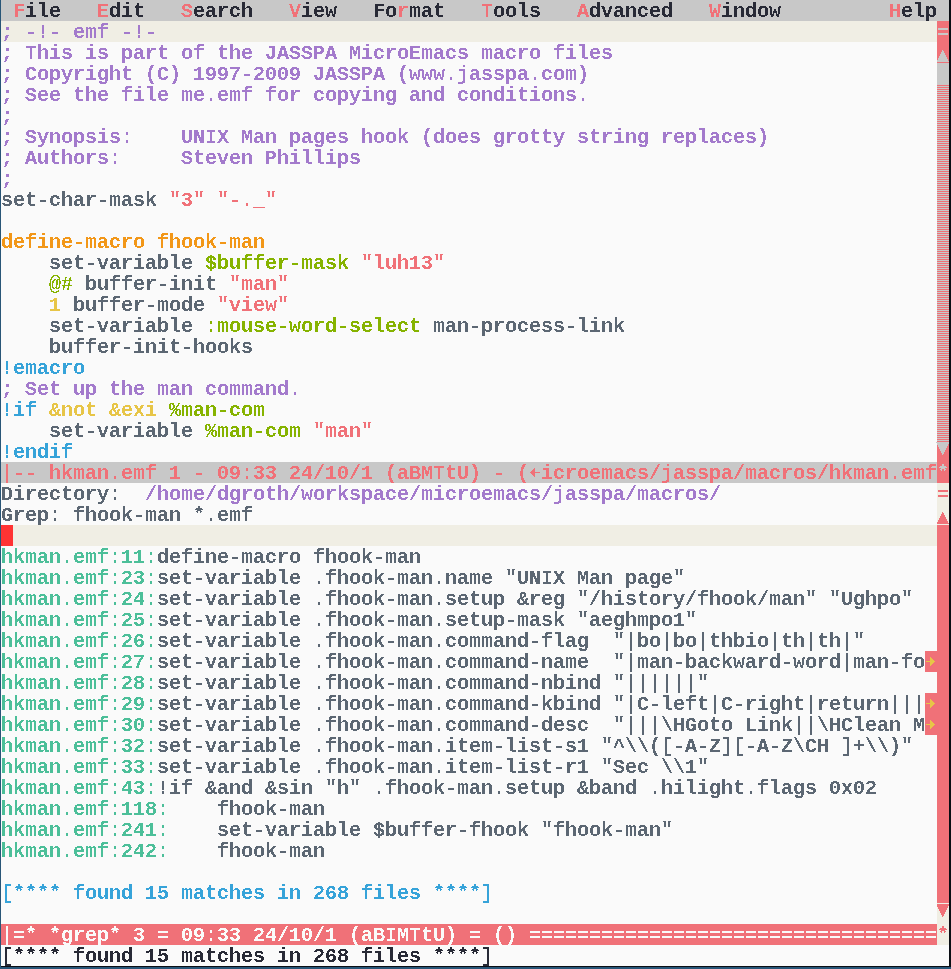
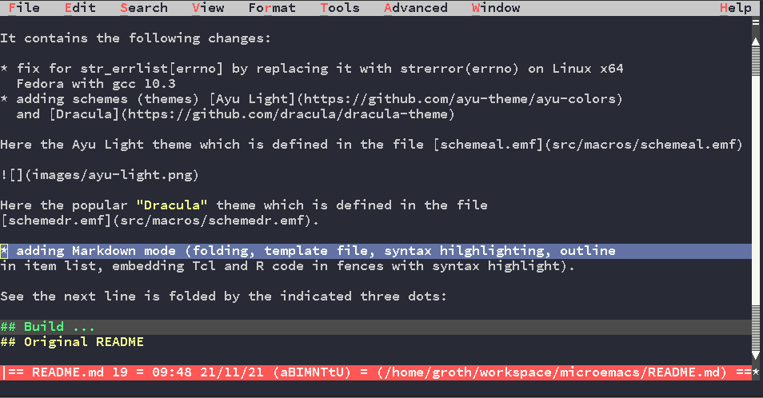

## MicroEmacs &nbsp;&nbsp;&nbsp;&nbsp;&nbsp;&nbsp;&nbsp;&nbsp;&nbsp;&nbsp;&nbsp;&nbsp; 

- [Executable Types](#Types)
- [New Features](#Features)
- [New Schemes](#Schemes)
- [Compilation](#Compilation)
- [Prebuild Binaries Downloads](#Downloads)

This is a fork of [Jasspa MicroEmacs](http://www.jasspa.com) forked from [https://github.com/vitalyster/microemacs](https://github.com/vitalyster/microemacs).

Extensible  Terminal and GUI text editor with Emacs feeling coming as a small, single
file  executable  for Windows,  Linux and MacOS.  

Main features:

- small!! and fast!!
- same user interface in terminal and in GUI mode
- Windows, Linux, macOS versions
- single file installs possible (2.5MB file size)
- Emacs (default) or CUA key bindings available
- menu entries for all main functions (Esc = in Terminal mode for menu)
- extensible programming language
- themes, customizations, templates, snippets menu or GUI accessible
- for its size the text editor with most features without being bloated

<a name="Types"> Executables  can be of three types:</a>

- _mec_ - console  only (around 600kb without macro files)
- _mew_ - X11/Windows  only (around  630kb without macro files)
- _mecw_  Terminal and X11 enabled - for Mac with XQuartz and for Linux with X11
 (650kb w/o macro files)

The bfs  executables (mecb and mewb) have as well all macro files, the internal help file and
the American  dictionary  embedded  (file size around  2.5Mb). For  simplicity
reasons all downloads on the release page are bfs-builds.

<a name="Features">New Features</a>

In  comparison to the version at the Jasspa  website it contains the following
changes / extensions:

* improved  terminal mode for  suspend-emacs  with using alternative  terminal
  buffer (thanks to Steven Phillips)
* basic git support with commands to add, commit and get status of files etc  
* easier addition of own user  templates with interactive template selection using the command "insert-template"
* easier font-selection on X11 using _xfontsel_ and easier resize on X11 (Mac and Linux) and Windows
* so font size increase and decrease using Ctrl-Plus and Ctrl-Minus keys
* more schemes (themes) [Ayu Light](https://github.com/ayu-theme/ayu-colors)
  and [Dracula](https://github.com/dracula/dracula-theme)
* much improved Markdown mode (folding, template file, syntax hilghlighting, outline
  in item list, embedding Tcl, Python, R and Dot code in fences with syntax highlight)
* AppImage for easy install o Linux systems
* example fonts Chivo  Mono, Ubuntu Mono and Courier Prime for better display on X11
* Linux (Ubuntu 20, 22, 24), Windows, Darwin 20, 21, 22 builds using Github actions
* Windows builds using cross compilation on Ubuntu with Github actions
* updates on documentation  
* fix for str_errlist[errno] by replacing it with strerror(errno) on Linux x64
  Fedora with gcc 10.3
* fix for hang on error bug if using the -n command line switch
* fix for frame resize on X11 if the font changes (thanks to Steven Phillips)

New important macro commands (see the internal help pages - version v09.12.22):

- `change-font-size` can be done as well with key bindings `C-Plus` and `C-Minus`
- X11 only (Linux, MacOS)
    - `change-font-xfontsel` - direct font selection using _xfontsel_
    - `change-font-bold`
    - `change-font-courier`
    - `change-font-lucida`
    - `change-font-type`
- `git-add`, `git-commit` etc    
- `execute-region` - for macro development
- `insert-template` - easier definition of user templates

<a name="Schemes"> </a>

Here the Ayu Light theme which is defined in the file [schemeal.emf](src/macros/schemeal.emf)



Here the popular "Dracula" theme which is defined in the file [schemedr.emf](src/macros/schemedr.emf).

See the folding feature for Markdown, in the image below (Dracula theme) the section
build is folded by the indicated three dots:


## Compilation

### Debian Systems

Below you find links to prebuild  binaries.  If you prefer to compile the code
yourself here are the required  commands for a Debian or Debian derived system
like MX Linux, Linux Mint or Ubuntu system:

Let's first build a console version:

```bash
### install packages
sudo apt install git build-essential libz-dev libncurses-dev
### fetch repo
git clone https://github.com/mittelmark/microemacs.git
cd microemacs
### builds the bfs executable for making stand-alone mecb and mewb etc
make -f linux32gcc.gmk bfs/bin
### builds standalone mecb  executable (Terminal)
make -f linux32gcc.gmk mecb
```

You  should  now  have  files  like  `mec-VERSION-PLATFORM.bin`  (VERSION  and
PLATFORM are just  placeholders)  which are standalone  executable  which have
included all macro files, the help file and the American  dictionary and which
can be run in the terminal by simply executing it.

Try the version flag:

```bash
./mecb-VERSION-PLATFORM -V
```

Now lets  build  afterwards  a GUI only  (mewb)  and a  combined  GUI/terminal
version (mecwb) which can be run both as a terminal and as a X11 application.

```bash
### install packages for X11 build
sudo apt install libxt-dev
### builds standalone mew executable (GUI)
make -f linux32gcc.gmk mewb
### builds combined standalone mecw executable (Terminal and GUI)
make -f linux32gcc.gmk mecwb
sudo apt install x11-utils    # xfontsel, xlsfonts - better font selection
```

### Red Hat Systems

Here the steps  required to compile the editor on Red Hat compatible systems  like CentOS
or AlmaLinux, For Fedora builds replace `yum` with `dnf`:

```bash
### install make, unzip, gcc
sudo dnf install make zip unzip gcc zlib-devel ncurses-devel git
### fetch repo
git clone https://github.com/mittelmark/microemacs.git
cd microemacs
### builds the bfs executable for making stand-alone mecb and mewb etc
make -f linux32gcc.gmk bfs/bin
### builds standalone mecb  executable (Terminal)
make -f linux32gcc.gmk mecb
### install X11 developer files
sudo dnf install libXt-devel
### builds standalone mew executable (GUI)
make -f linux32gcc.gmk mewb
### builds combined standalone mecw executable (Terminal and GUI)
make -f linux32gcc.gmk mecwb
### for more fonts and better font selection
sudo dnf install xorg-x11-apps ## xfontsel
sudo dnf install xorg-x11-fonts* ## Lucidatypewriter, Adobe courier
```

If you do not want to build these  executables  yourself you can just download
pre-build executables (see below).

## Cross-compilation on Linux for Windows:

You need the  Mingw32 GCC  compiler  and the Zip  library.  Here an install on
Fedora:

```
sudo dnf install mingw32-gcc mingw32-zlib
```

On Debian systems like Ubuntu:

```
sudo apt install build-essential mingw-w64 gcc-mingw-w64-i686 
sudo apt install libz-mingw-w64 libz-mingw-w64-dev
sudo apt install desktop-file-utils
```

Thereafter  you might  execute `make -f  win32mingw.gmk  mecb mewb` to get all
binaries for Windows on your Linux machine.

<a name="Downloads"> </a>
## Download Prebuild MicroEmacs Executables (v09.12.24-beta1)

Release v09.12.24b1 (beta-1) (2024-08-23):

New in comparison to v09.12.23

- adding git commands, git-add, git-commit, git-grep and others
- adding xfontsel font selection for MacOS and Linux change-font-xfontsel
- embedding libz on Windows for easier installation
- improved and bug fixed internal documentation
- new function `&llen` - for list length
- new directive `!iif` for single line if's (ported from ME 24 from Steven Phillips)
- support for TTF-files 
- support for ISO 8859-1..15 and Windows-CP1252 encodings with Euro symbol etc


| Platform      | mecb (terminal) | mewb (GUI)    | mecwb (terminal+GUI)       |
|:-------------:|:---------------:|:-------------:|:------------------------:|
| AlmaLinux 8   | [x](https://github.com/mittelmark/microemacs/releases/download/v09.12.24.beta1/linux-4-almalinux-8-microemacs-091224b1-mecb.zip) | [x](https://github.com/mittelmark/microemacs/releases/download/v09.12.24.beta1/linux-4-almalinux-8-microemacs-091224b1-mewb.zip) | [x](linux-4-almalinux-8-microemacs-091224b1-mecwb.zip) |
| AlmaLinux 9   | [x](https://github.com/mittelmark/microemacs/releases/download/v09.12.24.beta1/linux-6-almalinux-9-microemacs-091224b1-mecb.zip) | [x](https://github.com/mittelmark/microemacs/releases/download/v09.12.24.beta1/linux-6-almalinux-9-microemacs-091224b1-mewb.zip) | [x](linux-6-almalinux-9-microemacs-091224b1-mecwb.zip) |
| Fedora 39     | [x](https://github.com/mittelmark/microemacs/releases/download/v09.12.24.beta1/linux-6-fedora-39-microemacs-091224b1-mecb.zip) | [x](https://github.com/mittelmark/microemacs/releases/download/v09.12.24.beta1/linux-6-fedora-39-microemacs-091224b1-mewb.zip) | [x](linux-6-fedora-39-microemacs-091224b1-mecwb.zip) |
| Manjaro Linux | [x](https://github.com/mittelmark/microemacs/releases/download/v09.12.24.beta1/linux-6-manjarolinux-0-microemacs-091224b1-mecb.zip) | [x](https://github.com/mittelmark/microemacs/releases/download/v09.12.24.beta1/linux-6-manjarolinux-0-microemacs-091224b1-mewb.zip) | [x](linux-6-manjarolinux-0-microemacs-091224b1-mecwb.zip) |
| Ubuntu 20     | [x](https://github.com/mittelmark/microemacs/releases/download/v09.12.24.beta1/linux-5-ubuntu-20-microemacs-091224b1-mecb.zip) | [x](https://github.com/mittelmark/microemacs/releases/download/v09.12.24.beta1/linux-5-ubuntu-20-microemacs-091224b1-mewb.zip) | [x](linux-5-ubuntu-20-microemacs-091224b1-mecwb.zip) |
| Ubuntu 22     | [x](https://github.com/mittelmark/microemacs/releases/download/v09.12.24.beta1/linux-6-ubuntu-22-microemacs-091224b1-mecb.zip) | [x](https://github.com/mittelmark/microemacs/releases/download/v09.12.24.beta1/linux-6-ubuntu-22-microemacs-091224b1-mewb.zip) | [x](linux-6-ubuntu-22-microemacs-091224b1-mecwb.zip) |
| Ubuntu 24     | [x](https://github.com/mittelmark/microemacs/releases/download/v09.12.24.beta1/linux-6-ubuntu-24-microemacs-091224b1-mecb.zip) | [x](https://github.com/mittelmark/microemacs/releases/download/v09.12.24.beta1/linux-6-ubuntu-24-microemacs-091224b1-mewb.zip) | [x](linux-6-ubuntu-24-microemacs-091224b1-mecwb.zip) |
| MacOS 12      | [x](https://github.com/mittelmark/microemacs/releases/download/v09.12.24.beta1/macos-12-microemacs-091224b1-mecb.zip) | [x](https://github.com/mittelmark/microemacs/releases/download/v09.12.24.beta1/macos-12-microemacs-091224b1-mewb.zip) | [x](macos-12-microemacs-091224b1-mecwb.zip) |
| MacOS 13      | [x](https://github.com/mittelmark/microemacs/releases/download/v09.12.24.beta1/macos-13-microemacs-091224b1-mecb.zip) | [x](https://github.com/mittelmark/microemacs/releases/download/v09.12.24.beta1/macos-13-microemacs-091224b1-mewb.zip) | [x](macos-13-microemacs-091224b1-mecwb.zip) |
| MacOS 14      | [x](https://github.com/mittelmark/microemacs/releases/download/v09.12.24.beta1/macos-14-microemacs-091224b1-mecb.zip) | [x](https://github.com/mittelmark/microemacs/releases/download/v09.12.24.beta1/macos-14-microemacs-091224b1-mewb.zip) | [x](macos-14-microemacs-091224b1-mecwb.zip) |
| Windows 10/11 | [x](https://github.com/mittelmark/microemacs/releases/download/v09.12.24.beta1/windows-microemacs-091224b1-mecb.zip) | [x](https://github.com/mittelmark/microemacs/releases/download/v09.12.24.beta1/windows-microemacs-091224b1-mewb.zip) | - |

Download more programmers fonts: [TTF-Files] [see here on how to install them](README-standalone.md#Fonts):

## Download Prebuild MicroEmacs Executables

There  are  stand-alone   single  file  executable  build  for  the  following
platforms (if not mentioned otherwise the build platforms are 64 bit machines): 

- Linux
    - Antix 23 (32bit)
    - Ubuntu 16 (32bit)
    - Ubuntu 18
    - Ubuntu 20
    - Ununtu 22
    - Ununtu 24    
    - Fedora 30
    - Fedora 38
    - Fedora 40    
    - AlmaLinux 8.9
    - AlmaLinux 9.4
    
[Ubuntu](https://ubuntu.com/)      builds      should     be     usable     on
[Debian](https://www.debian.org/)   and  derived   distros,   such  as  [Linux
Mint](https://www.linuxmint.com)     or    [MX     Linux](https://mxlinux.org)
compatible.     [AlmaLinux](https://almalinux.org)     builds     should    be
[CentOS](https://www.centos.org)                                           and
[RHEL](https://www.redhat.com/en/technologies/linux-platforms/enterprise-linux)
compatible.  [Fedora](https://www.fedora.org) builds can be probably only used
on Fedora without problems.

- macOS
    - macOS 11
    - macOS 12
    - macOS 14    
- Windows

Build  for  other   platforms   might  be  provided  if  requested  using  the
[issues](https://github.com/mittelmark/microemacs/issues)    link    on   this
repository. The AppImage  should work on most Linux platforms.

Release 2024-03-29 (v09.12.23):

| OS      | Platform    | (X)-Windows Binary | Terminal Binary |
|:-------:|:------------|:-------------------|:----------------|
| Linux   | AppImage    | [AppImage](https://github.com/mittelmark/microemacs/releases/download/v09.12.21/Jasspa_MicroEmacs-x86_64.AppImage)| Run AppImage with -n option |
|         | Ubuntu 16 (32bit)| [mewb.zip](https://github.com/mittelmark/microemacs/releases/download/v09.12.23/MicroEmacs09_091223_linux-ubuntu16-32bit-mewb.zip)| [mecb.zip](https://github.com/mittelmark/microemacs/releases/download/v09.12.23/MicroEmacs09_091223_linux-ubuntu16-32bit-mecb.zip) |
|         | Antix  23 (32bit)| [mewb.zip](https://github.com/mittelmark/microemacs/releases/download/v09.12.23/MicroEmacs09_091223_linux-antix23-32bit-mewb.zip)| [mecb.zip](https://github.com/mittelmark/microemacs/releases/download/v09.12.23/MicroEmacs09_091223_linux-antix23-32bit-mecb.zip) |
|         | Ubuntu 18   | [mewb.zip](https://github.com/mittelmark/microemacs/releases/download/v09.12.23/MicroEmacs09_091223_linux-ubuntu18-mewb.zip)| [mecb.zip](https://github.com/mittelmark/microemacs/releases/download/v09.12.23/MicroEmacs09_091223_linux-ubuntu18-mecb.zip) |
|         | Ubuntu 20   | [mewb.zip](https://github.com/mittelmark/microemacs/releases/download/v09.12.23/MicroEmacs09_091223_linux-ubuntu20-mewb.zip)| [mecb.zip](https://github.com/mittelmark/microemacs/releases/download/v09.12.23/MicroEmacs09_091223_linux-ubuntu20-mecb.zip) |
|         | Ubuntu 22   | [mewb.zip](https://github.com/mittelmark/microemacs/releases/download/v09.12.23/MicroEmacs09_091223_linux-ubuntu22-mewb.zip)| [mecb.zip](https://github.com/mittelmark/microemacs/releases/download/v09.12.23/MicroEmacs09_091223_linux-ubuntu22-mecb.zip) |
|         | Ubuntu 24   | [mewb.zip](https://github.com/mittelmark/microemacs/releases/download/v09.12.23/MicroEmacs09-091223-linux-ubuntu24-mewb.zip)| [mecb.zip](https://github.com/mittelmark/microemacs/releases/download/v09.12.23/MicroEmacs09-091223-linux-ubuntu24-mecb.zip) |
|         | Fedora 30   | [mewb.zip](https://github.com/mittelmark/microemacs/releases/download/v09.12.23/MicroEmacs09_091223_linux-fedora30-mewb.zip)| [mecb.zip](https://github.com/mittelmark/microemacs/releases/download/v09.12.23/MicroEmacs09_091223_linux-fedora30-mecb.zip) |
|         | Fedora 38   | [mewb.zip](https://github.com/mittelmark/microemacs/releases/download/v09.12.23/MicroEmacs09_091223_linux-fedora38-mewb.zip)| [mecb.zip](https://github.com/mittelmark/microemacs/releases/download/v09.12.23/MicroEmacs09_091223_linux-fedora38-mecb.zip) |
|         | Fedora 40   | [mewb.zip](https://github.com/mittelmark/microemacs/releases/download/v09.12.23/MicroEmacs09-091223-linux-fedora40-mewb.zip)| [mecb.zip](https://github.com/mittelmark/microemacs/releases/download/v09.12.23/MicroEmacs09-091223-linux-fedora40-mecb.zip) |
|         | AlmaLinux 8.9 | [mewb.zip](https://github.com/mittelmark/microemacs/releases/download/v09.12.23/MicroEmacs09_091223_linux-alma89-mewb.zip)| [mecb.zip](https://github.com/mittelmark/microemacs/releases/download/v09.12.23/MicroEmacs09_091223_linux-alma89-mecb.zip) |
|         | AlmaLinux 9.4 | [mewb.zip](https://github.com/mittelmark/microemacs/releases/download/v09.12.23/MicroEmacs09_091223_linux-alma9_4-mewb.zip)| [mecb.zip](https://github.com/mittelmark/microemacs/releases/download/v09.12.23/MicroEmacs09_091223_linux-alma9_4-mecb.zip) |
| macOS   | macOS 11    | [mewb.zip](https://github.com/mittelmark/microemacs/releases/download/v09.12.23/MicroEmacs09_091223_macos-11-mewb.zip)| [mecb.zip](https://github.com/mittelmark/microemacs/releases/download/v09.12.23/MicroEmacs09_091223_Linux-macos-11-mecb.zip) |
|         | macOS 12    | [mewb.zip](https://github.com/mittelmark/microemacs/releases/download/v09.12.23/MicroEmacs09_091223_macos-12-mewb.zip)| [mecb.zip](https://github.com/mittelmark/microemacs/releases/download/v09.12.23/MicroEmacs09_091223_macos-12-mecb.zip) |
|         | macOS 14    | [mewb.zip](https://github.com/mittelmark/microemacs/releases/download/v09.12.23/MicroEmacs09_091223_macos-14-arm-mewb.zip)| [mecb.zip](https://github.com/mittelmark/microemacs/releases/download/v09.12.23/MicroEmacs09_091223_macos-14-arm-mecb.zip) |
| Windows | Win32/Win64 | [mewb.zip](https://github.com/mittelmark/microemacs/releases/download/v09.12.23/MicroEmacs09_091223_windows-32-mewb.zip)| [mecb.zip](https://github.com/mittelmark/microemacs/releases/download/v09.12.23/MicroEmacs09_091223_windows-32-mecb.zip) |

Installation  of these  executables  is easy.  Make  them  executable  on Unix
platforms and move them to a folder  belonging to your PATH variable.  Windows
users should just copy them as well to such a folder.


Release 2023-10-31 (v09.12.21):

* Linux 64bit
    * [Jasspa_MicroEmacs-x86_64.AppImage](https://github.com/mittelmark/microemacs/releases/download/v09.12.21/Jasspa_MicroEmacs-x86_64.AppImage) -
        Linux  AppImage  which should work on Debian,  Ubuntu, Fedora and probably others 64bit Linuxes as well
    * [Linux-Fedora-38-x86_64](https://github.com/mittelmark/microemacs/releases/download/v09.12.21/mecw-fedora-38-2023-11-02.bin)
    * [Linux-Ubuntu-18-x86_64](https://github.com/mittelmark/microemacs/releases/download/v09.12.21/mecw-ubuntu-18-2023-11-02.bin)
    * [Linux-Ubuntu-20-x86_64](https://github.com/mittelmark/microemacs/releases/download/v09.12.21/mecw-ubuntu-20-2023-11-02.bin)
* MacOS 11 64bit (should work on MacOS 12 and 13 as well)
    * [MacOS-Darwin-20-x86_64 -  console only](https://github.com/mittelmark/microemacs/releases/download/v09.12.21/mec-macos-12-2023-11-02.bin)
    * [MacOS-Darwin-20-x86_64 - console and XQuartz version](https://github.com/mittelmark/microemacs/releases/download/v09.12.21/mecw-macos-12-2023-11-02.bin)
* Windows 32 and 64bit
    * Install  using the scoop  package  manager on Windows  like this  `scoop install -a 32bit https://raw.githubusercontent.com/mittelmark/microemacs/master/scoop-jme.json`
    * Downloading the single files:
        * [Windows window version](https://github.com/mittelmark/microemacs/releases/download/v09.12.21/mew-windows-2023-11-02.exe)
        * [Windows console version](https://github.com/mittelmark/microemacs/releases/download/v09.12.21/mec-windows-2023-11-02.exe)
* Older builds for other OS are provided here [http://www.jasspa.com/](http://www.jasspa.com/)

Just  download an  executable  for your  platform  which matches as closely as
possible your operatig system. For instance for Fedora 39, you download the binaries for Fedora 38.
On Unix systems you make the file  executable  (chmod 755 filename) and rename
it for  instance  to me, then  copy it to a  folder  belonging  to your  PATH.
Therafter you can run the me executable.  The first thing you have to do is to
select the right  keyboard  configuration  after  starting your first session.
Choose teh menu entry "Tools -> User Setup" and then  "Keyboard"  the Start-Up
tab.

The executables linked  above  come with an embedded American  dictionary.  To use other
dictionaries  download the dictionary  files for your language from the relase
page: 
[https://github.com/mittelmark/microemacs/releases](https://github.com/mittelmark/microemacs/releases):
and place tese files  in your  personal  user folder  `~/.jasspa` on Linux for
instance.  Then use "Tools -> User Setup -> Language  settings"  to switch the
dictionary.

## BFS executables 

The BFS executables can be used to extract the binary and the macro files from the
MicroEmacs  executables and to build you own executables with other dictionary
files, other user templates, or additional macro files. So you can customize your MicroEmacs version.

Here an example on how to do so:

```bash
### get the German dictionary files
wget http://www.jasspa.com/spelling/ls_dede.zip
### extract the arcive from the file me-linux.bin
bfs -x jasspa me-linux.bin
### add new spellings
cd jasspa/spelling
unzip ../../ls_dede.zip
### create the new file
bfs -a me-linux.bin ./jasspa -o me-linux2.bin
### test the terminal
MEPATH="" TERM=rxvt ./me-linux2.bin -n
```

<a name="ProsCons"> </a>
## Pros and Cons of Jasspa MicroEmacs

* Pro:
    * simple single file install
    * small and fast 1-4 MB!! memory footprint
    * support for Linux, MacOS and Windows
    * almost same usage in terminal and GUI mode
    * menu access to use command File, Edit etc commands A-f, A-e in GUI mode or "esc =" in terminal mode
    * internal interactive help system
    * distraction  free coding, no popups, no annoying  updates - just you and
      the editor
    * Emacs like shortcuts
    * CUA windows key-bindings as fallback for total newbees
    * standard  menu entries on top for beginners who do not yet know all the
      key bindings of Emacs
    * easy to extend, the file _USER.emf_ is your friend
    * different color themes can be used and changed easily
    * sophisticated macro programming language
    * easy to configure file templates and snippets
* Cons:
    * No unicode! It is a MICRO-Emacs!
    * No softwrap! Use `Esc q` for paragraph wrapping! Or use the wrap buffer mode

## Links

* [Original Jasspa homepage (outdated currently)](http://www.jasspa.com)
* [new mailing list](https://groups.google.com/g/jasspa-microemacs)
* [old downloads](http://www.jasspa.com/downlatest.html)
* standalone executables from [2009](http://www.jasspa.com/zeroinst.html) and [2023](https://github.com/mittelmark/microemacs/releases/tag/v09.12.21)
* [quick start](http://www.jasspa.com/release_20090909/jasspame.pdf)
* [spelling dictionaries](http://www.jasspa.com/spelling.html)
* [online help](https://www.dgroth.de/me2009/me/index.htm)
* [MicroEmacs help chm-file (2009)](https://www.dgroth.de/downloads/me2009.chm)
* [WIP tutorial on the Macro Language](https://htmlpreview.github.io/?https://raw.githubusercontent.com/mittelmark/microemacs/master/docs/emf-tutorial.html)

    
## Build

I currently build on Fedora ad Ubuntu using the file _src/linux32gcc.gmk_. Other Makefiles you should take from [https://github.com/ipstone/microemacs/tree/master/src](https://github.com/ipstone/microemacs/tree/master/src)

To build switch into the src directory and then run the Makefile for your plaform. On my Linux machine I did:

```
cd src && make -f linux32gcc.gmk
```

Which  then  produces  in the  folder  .linux32gcc-release-mecw  the  required
executable.

I as well cross compile on my Linux systems for Windows. You can do the same assuming that you
have installed on your Linux system the mingw32 gcc compiler and the required tools. The you can do this:

```
cd src && make -f win32mingw.mak CC=i686-w64-mingw32-gcc RC=i686-w64-mingw32-windres
cd src && make -f win32mingw.mak CC=i686-w64-mingw32-gcc RC=i686-w64-mingw32-windres BTYP=c
```

Which  then  produces  in the  folder  .win32mingw-release-mew  and -mec the  required
executables.

If you place the file zlib1.dll and eventuall the file dssp-0.dll in the same folder as the executable that file should be run using wine directly
on a Linux system. To check the executable on Linux using wine you do
something like this:

```
MEPATH=Z:/home/username/workspace/microemacs/jasspa/macros wine ~/path/to/mew32.exe
```

You can as well create an alias to shorten the command line.

## Terminal issues

### Menu access

The menu access is usually available using the F1 key, but sometimes this does
not work as it is already bound by the terminal to some other  function. As an
alternative  you can use the key  binding  "Esc =" to access  the main menu on
top.

### Backspace key

The  backspace  key for  some  terminals  is not  mapped  to  delete  the last
caracter, you might use instead `C-h` to delete the last character.


### Color issues

As the  capabilities of Terminals differ widely  MicroEmacs  starts usually in
black/white  mode in the terminal. You can set this to color mode by selecting the
"Tools -> User Setup -> Platform" Termcap option. If this does  not work you might
in addition  declare the terminal type before starting me like so:  `TERM=rxvt  me -n` given me
is you executable  that could be as well defined as an alias in your `.bashrc`
file for instance like this:

```
### .bashrc
alias mec="TERM=rxvt me -n"
```

### Windows Terminal

I usually  recommend  the   [Msys2](https://www.msys2.org)   environment  for
developers if they have to use the Windows  operating  system. As the provided
Windows build is a native  Windows build, the console  version of Me09 must be
started via the cmd  Terminal on Windows. You should use in this case an alias
like this in your .bashrc

```bash
### add this to your .bashrc
### we assume that you copied the windows executables
### to the bin folder in your msys HOME
function me {
    if [ $1 == "-n" ]; then
        ## running terminal version
        shift 1
        cmd //C `cygpath -wa ~/bin/mec-windows.exe` "${@}"
        
    else
        `cygpath -wa ~/bin/mew-windows.exe` "${@}" &
    fi
}
```

For cygwin like environments like MobaXterm the following did work:

```bash
### add this to your .bashrc
function me {
    if [ $1 == "-n" ]; then
        shift 1
        MPATH=`cygpath -wa ~/bin/mec-windows.exe`
        MPATH=`echo $MPATH | sed 's.\\\./.g'`
        # MobaXterm fix
        if [ ! command -v conin &> /dev/null ]
        then
            # no conin try this
            cmd //C $MPATH "${@}"
        else
            conin cmd /C $MPATH "${@}"
        fi
    else
        ~/bin/mew-windows.exe "${@}" &
    fi
}
```

In case you are  interested  there might be a chance to create "native" Cygwin
and          Msys          builds.          Please          create          an
[issue](https://github.com/mittelmark/microemacs/issues) a the Github page.


## Original README

Here the link to the original Jasspa MicroEmacs [README](README).

## Links

* [Jasspa Homepage](http://www.jasspa.com/)
* [Github Repo with sources from 2010 with fixes for Mingw64 but removed Makefiles (terminal build via cmake)](https://github.com/vitalyster/microemacs)
* [Github Repo with sources from 2010 and fixes for Mac and BSD](https://github.com/ipstone/microemacs)
* [Github Repo with sources from 2009](https://github.com/cstrotm/jasspa-microemacs)
* [Github Repo with fixes for MSDOS](https://github.com/robdaemon/microemacs)
* [MicroEmacs Online Help (2006)](http://www.jasspa.com/me.html)
* [MicroEmacs Online Help (2000)](https://www.dgroth.de/me2009/me/index.html)
* [MicroEmacs Refcard](https://web.archive.org/web/20160328000629/http://www.jamesie.de/microemacs/me-refcard.pdf)
* [MicroEmacs.de](http://www.dgroth.de/pmwiki/index.php?n=MicroEmacs.MicroEmacs)
* [MicroEmacs chm file (2002)](http://www.dgroth.de/downloads/me2002.chm)
* [MicroEmacs chm file (2009)](http://www.dgroth.de/downloads/me2009.chm)

## License

MicroEmacs  is released with the GPL, see the file  [license.txt](license.txt)
and [COPYING](COPYING).

## EOF
