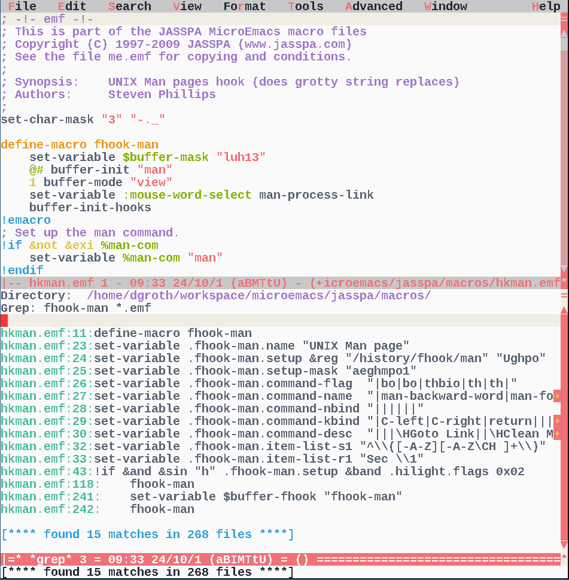
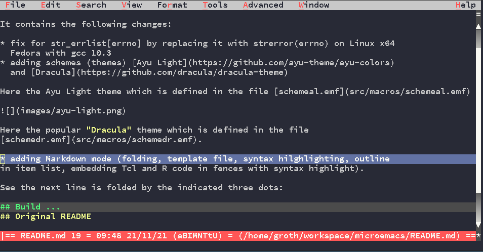
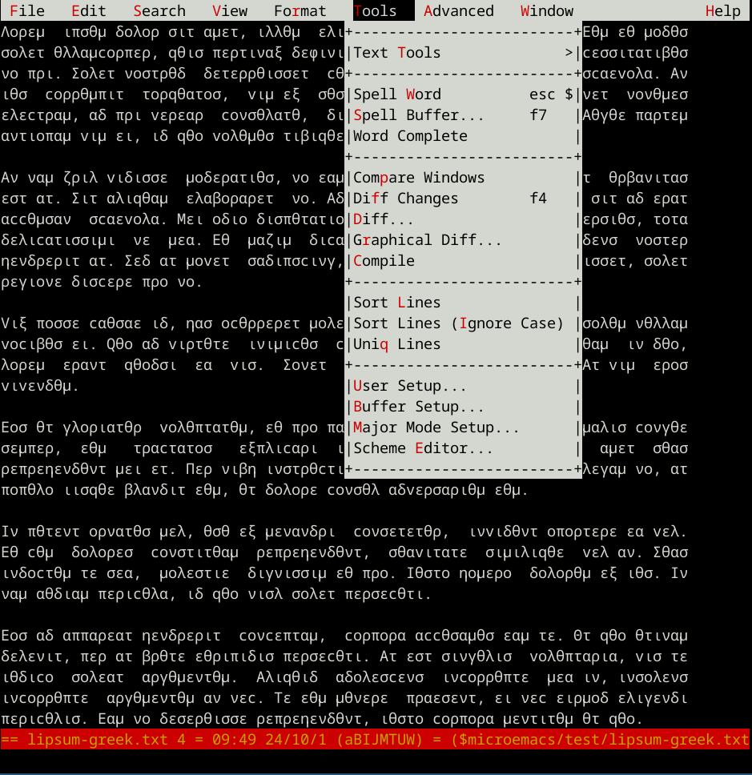
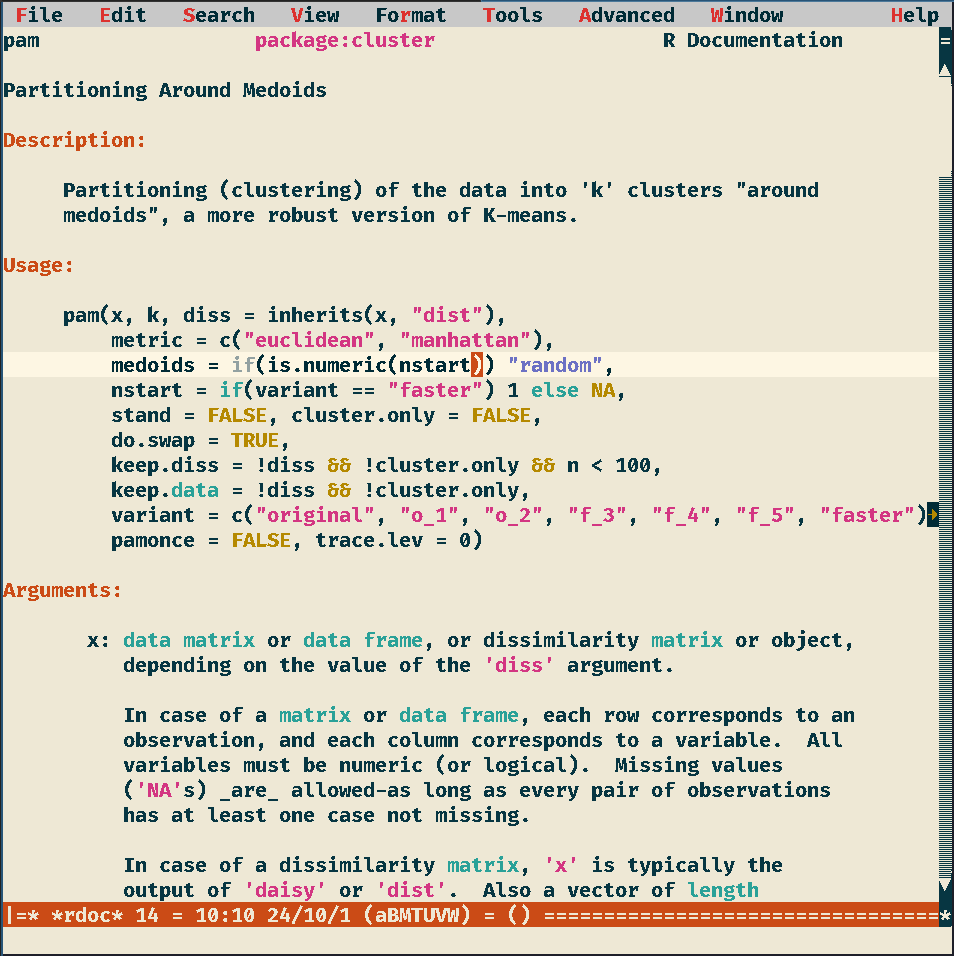

##   Jasspa MicroEmacs 2009 / [Jasspa MicroEmacs 2026](https://github.com/bjasspa/jasspa)

[](https://www.gnu.org/licenses/gpl.htm)
[](https://github.com/mittelmark/microemacs/releases)


/badge.svg)
/badge.svg)
/badge.svg)
/badge.svg)
/badge.svg)

__MicroEmacs: Lightweight but powerful extensible terminal and GUI text editor with Emacs like keybindings providing menu support and having an extensible macro language.__

> [!NOTE]
> New users should consider using [MicroEmacs 2026](https://github.com/bjasspa/jasspa) 
> which has better support for Unicode in terminals, more modern font support on X11 and as well adds
> SSL (https) support. New development will take place mainly in the MicroEmacs 26  project.  
> Here we will add  mainly smaller improvements and bugfixes.  
> Currently FreeBSD, Linux 32 bit, Linux kernel 4 builds are only  available  for
> MicroEmacs 09, so the binaries for this project here which you find below.

> [!CAUTION]
> New features since 2026 are coded partially using AI tools like Opencode and models like Pick Pickle and MiMo 2.5.
> The changes are carefully reviewed and a lot of manual editing of problematic model outputs is still done.

<a name="installation"> </a>
## Installation

### Unix systems<a name="unix"> </a>

Here in short the single file install command using a shell script for Unix systems like Linux, MacOS or FreeBSD and for Windows Cygwin or Windows Msys2:

```bash
bash -c "$(curl -fsSL https://github.com/mittelmark/microemacs/releases/latest/download/install.sh)"
source ~/.bashrc ## for the current session update the PATH settings
mecb -V
mewb -V
```

If you install the `mecb` and `mewb`  executables you at the same time install
an update script `mecb-update` which can be called to check for updates. Here a typical output:

```bash
$ mecb-update 
Found local mecb at: /home/dgroth/.local/bin/mecb
Existing version: 091226b6, Latest version: 091226b6
Installed version 091226b6 is up to date (>= 091226b6). Nothing to do.
```

You can  then  start  either  the  terminal  version  with the  command  
`mecb arguments`  or the  X11/Windows  version  with `mewb  arguments`.  
For  better display  and UTF-8 font  support you have to install the tool  `fc-list` on X11
systems  which should be installed  per default on many systems, if not try to
install the `fontconfig` package on your system.

On Cygwin Windows you might as well need to install `libxt6` for instance on MobaXterm you should execute 
`apt install libxt6` to run the `mewb` executable.

For versions before MicroEmacs 091226b6 a few workarounds (luit, xfontsel and
XLFD fonts) were required for UTF-8 terminals and better X11 font support.
These legacy notes are collected in [doc/RELEASES-old.md](doc/RELEASES-old.md).

<a name="spelling"> </a>
### Install Spelling Dictionaries

The spelling dictionaries for several languages can be downloaded manually and placed into the MicroEmacs `$user-path` folder from the release page of [v0.9.0](https://github.com/mittelmark/microemacs/releases/v0.9.0)
or by for Unix systems or Microsoft Cygwin using a bash install script like this:

```
bash -c "$(curl -fsSL https://github.com/mittelmark/microemacs/releases/latest/download/install-dict.sh)"
```

<a name="windows"> </a>
### Windows 10/11

> [!CAUTION]
> You can't run MicroEmacs 09 or MicroEmacs 25 currently easily on the same machine. If you installed ME 26 and it works fine,
> stick with it. MicroEmacs 09 is just thought as a fallback option when ME 25 does not work as expected.  In this case please fill
> an issue item on the [ME 25 project page](https://github.com/bjasspa/jasspa). 
> The Windows Cygwin  binaries can however be used in parallel to ME 25 Windows builds. 
> Cygwin binaries are installed as described above using the Bash install.sh script.


For a Windows installation you can do the following after opening a Powershell
Terminal and executing the following four lines of code:

```
Set-ExecutionPolicy -ExecutionPolicy RemoteSigned -Scope CurrentUser
Invoke-RestMethod -Uri https://github.com/mittelmark/microemacs/releases/latest/download/install-windows.ps1 | Invoke-Expression
mewb -V
mecb -V
```

The  executable  mewb is then in the PATH ($env:LOCALAPPDATA) and you can run it from any terminal
window or after pressing the Win-r combination and then typing mewb in the run
command line. There should be as well a start menu entry for the "MicroEmacs 09" executable.

Further since version 26-beta4 you can run the batch script `mecb-update.bat`
from a Windows terminal to check for updates of the installed executables.

## Table of Contents

- [Installation](#installation)
    - [Unix systems](#unix)
    - [Spelling Dictionaries](#spelling)
    - [Windows](#windows)
- [New Schemes](#Schemes)
- [Executable Types](#Types)
- [New Features](#Features)
- [Compilation](#compilation)
    - [Linux Debian/Ubuntu](#debian)
    - [Linux Fedora/Alma Linux/Red Hat](#redhat)
    - [Linux Manjaro/Arch](#manjaro)
    - [Windows Cross Compilation](#crosswin)
    - [Windows Cygwin Compilation](#cygwin)
    - [MSYS2 Compilation](#msys2)
    - [FreeBSD Compilation](#freebsd)
- [Binaries Downloads](#Downloads)
- [Terminal issues](#terminal-issues)
- [Links](#links)

Extensible  Terminal and GUI text editor with Emacs feeling coming as a small, single
file  executable  for Windows,  Windows Cygwin, Windows-WSL, Linux, MacOS and FreeBSD.  

__Main features - Pros:__

- small!! and fast!!
- character based user interface working the same way in the terminal and in GUI mode 
- mouse support in Terminal and GUI versions
- menu entries for all main functions (Esc = in Terminal mode for menu, if mouse is disabled)
- Windows, Windows Cygwin, Linux, macOS and FreeBSD versions all working the same file
- inbuild help system
- single file install (2.5MB-4MB file size)
- Emacs like (default) or CUA key bindings available
- extensible programming language
- themes, customizations, templates, snippets menu or GUI accessible
- for its size the text editor with most features without being bloated

__DEMO (mdview command for browsing and editing Markdown files):__

[](https://asciinema.org/a/m9Pjw4BD2JsZrGht)

__Main Cons:__

- No Unicode (but full ISO and Windows encoding support) - you can type usually all the keys from your keyboard
- No softwrap (but automatic wrap is available)

This  is a fork  of  [Jasspa  MicroEmacs](http://www.jasspa.com)  forked  from
[https://github.com/vitalyster/microemacs](https://github.com/vitalyster/microemacs).
It is an extended  version of the  MicroEmacs  2009 release which was the last
official release available at the website [http://www.jasspa.com](http://www.jasspa.com).

## Schemes
<a name="Schemes"> </a>

&nbsp;&nbsp;

Left the Ayu Light theme which is defined in the file [schemeal.emf](src/macros/schemeal.emf) and
right the popular "Dracula" theme which is defined in the file [schemedr.emf](src/macros/schemedr.emf).
See the folding feature for Markdown, in the image below (Dracula theme) the section
build is folded by the indicated three dots:

&nbsp;&nbsp;

Left  Greek  Lipsum text in a ME  terminal  session as well displaying the menu.  On the
right the Solarized  Light theme showing R documentation  for the function pam
in the cluster package.

<a name="Types"> Executables  can be of three types:</a>

- _mec(b)_ - console  only (around 600kb without macro files)
- _mew(b)_ - X11/Windows  only (around  630kb without macro files)
- _mecw(b)_  Terminal and X11 enabled - for Mac with XQuartz and for Linux with X11
 (650kb w/o macro files)

The bfs  executables (mecb, mewb and mecwb) have as well all macro files, the internal help file and
the American  dictionary  embedded  (file size around  2.5-4.0Mb  depending on
the platform). For  simplicity reasons all downloads on the release page are bfs-builds, so single file installs.

<a name="Features">New Features</a>

In  comparison to the version at the Jasspa  website it contains the following
changes / extensions:

* improvements in the terminal mode:
    - UTF8 support
    - libXft with modern font rendering (thanks to Steven Phillips)
    - mouse support
    - 16 instead of colors in terminal mode
    - clipboard support using terminal command line tools like xclip, wl-copy, pbpaste, clip.exe 
    - suspend emacs using alternative  terminal
  buffer (thanks to Steven Phillips)
* new command `mdview` which can switch between viewing, browsing and editing a set of Markdown files  
* basic git support with commands to add, commit and get status of files etc  
* easier addition of own user  templates with interactive  template  selection
  using the command "insert-template"
* support for Go, Tcl and Python and many other languages for linters and formatters, other programming
  languages on request using the command file-format, file-lint and file-exec
* more schemes  (themes): [Ayu  Light and Dark](https://github.com/ayu-theme/ayu-colors),
  [Dracula](https://github.com/dracula/dracula-theme), [Solarized Light and Dark](https://ethanschoonover.com/solarized/),
  Adwaita Dark and Light, Tango Light and Dark, Nord
* editor themes can be directly loaded from xrdb theme files like these from the [iTerm2-Color-Schemes repo](https://github.com/mbadolato/iTerm2-Color-Schemes/tree/master/xrdb)   
  using the _xrdb-scheme_ macro
* better support for TTF-fonts on X11 and their ISO-8859-1 .. 15 and Windows-Cp1252 encodings
* easier font-selection on X11 using _xfontsel_ from the _user-setup_ or using the _change-font-xfontsel_ macro 
* easier font resize on X11 (Mac and Linux) and Windows using Ctrl-Plus and Ctrl-Minus keys
* documenting ME macro functions as well with basic Markdown syntax - see _define-help_ help page
* much improved Markdown mode (folding, template file, syntax hilghlighting, outline
  in item list, embedding Tcl, Python, R and Dot code in fences with syntax highlight)
* improved Python, Shell, Tcl and R support with folding, item-list and abbreviations
* improved CUA bindings and jeany-bindings where CUA bindings (C-s, C-x, C-v etc are prefixed with C-j
  so that still all Emacs bindings  are available
* Linux, Windows, Windows Cygwin, Windows Msys2 and MacOS builds using Github actions
* updates on documentation  
* various code fixes to allow compilation on modern compilers
* fix for window resize on X11 and the Windows terminal

New important macro commands (see the internal help pages - version v09.12.24):

- `mdview` - Markdown browser, viewer and editor 
- `r-doc` - loading R documentation as hypertext help within ME
- `py-doc` - loading Python documentation within ME
- `change-font-size` can be done as well with key bindings `C-Plus` and `C-Minus`
- X11 only (Linux, MacOS)
    - `change-font-xfontsel` - direct font selection using _xfontsel_
    - `change-font-bold`
- `git-add`, `git-commit`, `git-status`, `git-diff`  etc    
- `execute-region` - for macro development
- `insert-template` - easier definition of user templates
- `xrdb-scheme` - load directly [xrdb color schemes]((https://github.com/mbadolato/iTerm2-Color-Schemes/tree/master/xrdb)   )
- `r-exec`,  `r-format`  and `r-lint` to execute, reformat or check R code for
  possible problems
- `py-exec`,  `py-format`  and `py-lint` to execute,  reformat or check Python code for
  possible problems
- `tcl-exec`,  `tcl-format`  and `tcl-lint` to execute,  reformat or check Tcl code for
- `go-exec`,  `go-format`  and `go-lint` to execute,  reformat or check Go code for
- `file-exec`, `file-lint`  and `file-format` generic forms of the previous mentioned language specific commands

## Compilation

<a name="debian"> </a>
### Debian Systems

Below you find links to prebuild  binaries.  If you prefer to compile the code
yourself here are the required  commands for a Debian or Debian derived system
like MX Linux, Linux Mint or Ubuntu system:

Let's first build a console version:

```bash
### install packages
sudo apt install git build-essential libz-dev libncurses-dev
### fetch repo
git clone https://github.com/mittelmark/microemacs.git
cd microemacs
### builds the bfs executable for making stand-alone mecb and mewb etc
make -f makefiles/unixgcc.gmk bfs/bin
### builds standalone mecb  executable (Terminal)
make -f makefiles/unixgcc.gmk mecb
```

You  should  now  have  files  like  `mec-VERSION-PLATFORM.bin`  (VERSION  and
PLATFORM are just  placeholders)  which are standalone  executable  which have
included all macro files, the help file and the American  dictionary and which
can be run in the terminal by simply executing it.

Try the version flag:

```bash
./mecb-VERSION-PLATFORM -V
```

Now lets  build  afterwards  a GUI only  (mewb)  and a  combined  GUI/terminal
version (mecwb) which can be run both as a terminal and as a X11 application.

```bash
### install packages for X11 build
sudo apt install libxt-dev libxft-dev pkgconf
### builds standalone mew executable (GUI)
make -f makefiles/unixgcc.gmk mewb
### builds combined standalone mecw executable (Terminal and GUI)
make -f makefiles/unixgcc.gmk mecwb
sudo apt install fontconfig  # fc-list - better font selection
sudo apt install x11-utils xfonts-utils ## xfontsel mkfontscale for using ttf fonts (not required anymore)
sudo apt install xclip ## for better clipboard support
sudo apt install wl-clipboard  ## if running Wayland desktop or window manager for copy and paste
```

<a name="redhat"> </a>
### Red Hat Systems

Here the steps  required to compile the editor on Red Hat compatible systems  like CentOS
or AlmaLinux, For Fedora builds replace `yum` with `dnf`:

```bash
### install make, unzip, gcc
sudo dnf install make zip unzip gcc zlib-devel ncurses-devel git
### fetch repo
git clone https://github.com/mittelmark/microemacs.git
cd microemacs
### builds the bfs executable for making stand-alone mecb and mewb etc
make -f makefiles/unixgcc.gmk bfs/bin
### builds standalone mecb  executable (Terminal)
make -f makefiles/unixgcc.gmk mecb
### install X11 developer files
sudo dnf install libXt-devel libXft-devel pkgconf
### builds standalone mew executable (GUI)
make -f makefiles/unixgcc.gmk mewb
### builds combined standalone mecw executable (Terminal and GUI)
make -f makefiles/unixgcc.gmk mecwb
### for more fonts and better font selection
sudo dnf install xorg-x11-apps ## xfontsel
sudo dnf install xorg-x11-fonts* ## Lucidatypewriter, Adobe courier
sudo dnf install wl-clipboard # if running Wayland for copy and paste support
```


<a name="manjaro"></a>

### Arch Systems like Manjaro Linux

Here the steps  required to compile the editor on Arch based systems like Manjaro.

```bash
### install make, unzip, gcc, etc
sudo pacman -S make gcc ncurses git zlib pkgconf libxft fontconfig xorg-xfontsel ttf-fira-mono
### fetch repo
git clone https://github.com/mittelmark/microemacs.git
cd microemacs
### builds the bfs executable for making stand-alone mecb and mewb etc
make -f makefiles/unixgcc.gmk bfs/bin
### builds standalone mecb  executable (Terminal)
make -f makefiles/unixgcc.gmk mecb
### install X11 developer files seems not required on Manjaro
### builds standalone mew executable (GUI)
make -f makefiles/unixgcc.gmk mewb
### builds combined standalone mecw executable (Terminal and GUI)
make -f makefiles/unixgcc.gmk mecwb
### for more fonts and better font selection (not really neccessary anymore)
xset fp rehash ## update the fontpath settings to the current session
```


<a name="crosswin"> </a>
### Cross-compilation on Linux for Windows:

You need the  Mingw32 GCC  compiler  and the Zip  library.  Here an install on
Fedora:

```
sudo dnf install mingw32-gcc mingw32-zlib
```

On Debian systems like Ubuntu:

```
sudo apt install build-essential mingw-w64 gcc-mingw-w64-i686 
sudo apt install libz-mingw-w64 libz-mingw-w64-dev
sudo apt install desktop-file-utils
```

Thereafter  you might  execute `make -f  linuxmingwgcc.gmk mecb mewb` to get all
binaries for Windows on your Linux machine.

If you place the file zlib1.dll and eventuall the file dssp-0.dll in the same folder as the executable that file should be run using wine directly
on a Linux system. To check the executable on Linux using wine you do
something like this:

```
MEPATH=Z:/home/username/workspace/microemacs/jasspa/macros wine ~/path/to/mew.exe
```

You can as well create an alias to shorten the command line.

<a name="cygwin"> </a>
### Compilation on Cygwin Windows

Here are the steps to compile on Cygwin Windows if using the apt-cyg / cyg package manager.

For Windows I used [MobaXterm](https://mobaxterm.mobatek.net/) version 25.2 for the compilation.

```
apt install git gcc-core make unzip git libncurses-devel libXt-devel zlib-devel \
    libxft-devel fontconfig
git clone https://github.com/mittelmark/microemacs.git
cd microemacs
## Or if git is not working or not installed (what was true for MobaXterm 25.2): 
## wget https://github.com/mittelmark/microemacs/archive/refs/heads/master.zip
## unzip master.zip && cd microemacs-master
make -f makefiles/unixgcc.gmk bfs/bin ## bfs tool for standalone MicroEmacs files
make -f makefiles/unixgcc.gmk mecb    ## console version
make -f makefiles/unixgcc.gmk mewb    ## X11 version
make -f makefiles/unixgcc.gmk mecwb   ## X11 and console version
## for better font support
apt install xfontsel mkfontscale xset
```

The  same  _unixgcc.gmk_  makefile  is  used  on  Cygwin  and  Linux,  the
platform  is detected  automatically,  the Cygwin output folders are named
_.cygwin-release-*_ and the Linux ones _.linuxgcc-release-*_.

<a name="msys2"> </a>
### Compilation on MSYS2 Windows

In an  [MSYS2](https://www.msys2.org)  shell (UCRT64, MINGW64, CLANG64 or
MSYS)  install  the  required  packages  and  build  with  the  same  _unixgcc.gmk_
makefile, the terminal console version only (no X11 libraries exist for MSYS2):

```bash
pacman -S make gcc ncurses-devel zlib-devel git
git clone https://github.com/mittelmark/microemacs.git
cd microemacs
make -f makefiles/unixgcc.gmk bfs/bin ## bfs tool for standalone MicroEmacs files
make -f makefiles/unixgcc.gmk mecb    ## console version
```

The executables are placed in a _.msysunix-release-*_ folder. For the Windows
GUI  version  (_mewb_)  use  the  native  Windows  build  from  the  download
section  above  or  cross-compile  it  on  Linux  with  _linuxmingwgcc.gmk_
(see the cross-compilation section above).


<a name="freebsd"> </a>
### FreeBSD and GhostBSD

If you  install  gcc on  FreeBSD it comes with the  ncurses  libraries
already included so for the compilation you install the following tools:

```bash
sudo pkg install gcc
sudo pkg install Xorg libX11 libXft
### GhostBSD as well: sudo pkg install -g 'GhostBSD*-dev'
```

Therafter  you  should be able to compile  the  application  using the
Makefile in the microemacs root project folder.

```bash
### compile the barebone executables
make -f makefiles/freebsd.mak bfs/bin mec mew mecw
### compile the standalone executables
make -f makefiles/freebsd.mak mecb mewb mecwb
```

The Makefile has the extension  `mak` as it can use the default `make`
utility from FreeBSD and does not need the gnu-make version `gmake`.

Plain  `make` in the  project  root  works  as  well,  the  root  `Makefile`
detects  the  platform  and  forwards  the  goals  to  `freebsd.mak`.

<a name="Downloads"> </a>

## Download Prebuild MicroEmacs Executables (v09.12.26b6)

This release provides the following new features in comparison to v09.12.26b5:

- Encodings: UTF-8 support on all platforms and for both versions (terminal and GUI).
- Encodings: Per buffer encoding, parallel use of UTF-8, ISO and Windows encodings is possible
- GUI-Fonts: better font rendering on Unix using libxft for TrueType fonts (requires fontconfig install).
- Interface: Font-Dialog on Unix systems for the GUI version selecting TrueType fonts
- AppImage: Ubuntu 22 based app images available again
- Macro language: triple nested while and repeat loops.
- Building: More Unified Makefile to target Linux, FreeBSD, macOS, Msys2 and Cygwin builds

## Download Prebuild MicroEmacs Executables (v09.12.26b5)


This release provides the following new features in comparison to v09.12.26b4:

- fix for clipboard tool calling in macros leading to crashes in Wayland
- fix for window resize in Windows terminal regarding height
- adding new command `mdview` a Markdown browser, switching between view and edit (using 'q')
- add new bindings `C-c c` (copy region to system clipboard), `C-c y` (yank from system clipboard)
  and `C-c x` (kill region to clipboard)

It further contains the following new features in comparison the v09.12.25 (2025) release.

- support for mouse in terminal on Windows  and Unix (except for oder VTE based terminals lile ROXterm)
- terminal version: support for Clipboard on Unix
- terminal version: support for 16 colors in the terminal
- terminal version: automatic detection and use of colors, no need for TERM=xterm anymore
- support for clipboard on Wayland and X11 (activate in user-setup, system), on Wayland wl-clipboard package is required, on X11 xclip gives full support for primary and clipboard
- new theme Nord
- new platform: Windows Msys2 terminal platform supported with filepaths like /c/ or /home etc
- new platform: Linux Distros with Kernel 7 (intel and aarch64)
- new platforms: FreeBSD 15, MacOS 26 (intel and apple chips), MacOS 27 (only apple chip)
- new programming/diagram languages: PlantUML, Haxe transpiler, Fusion transpiler, Groovy, Scala, Typescript
- bugfix: for crash on terminal resize on Windows
- bugfix: on Unix for cut and paste (beta2 and beta3 fix, requiring xclip (X11), wl-clipboard (Wayland), pbpaste (macOS)

| OS          | Platform          | mecb (terminal) | mewb (GUI)    | mecwb (terminal+GUI)       |
|:-----------:|:-----------------:|:---------------:|:-------------:|:--------------------------:|
| Linux i686  | Ubuntu 18 / Antix 23 (32bit) | [x](https://github.com/mittelmark/microemacs/releases/download/v09.12.26.beta5/linux-5-i686-ubuntu-18-microemacs-091226b5-mecb.zip) | [x](https://github.com/mittelmark/microemacs/releases/download/v09.12.26.beta5/linux-5-i686-ubuntu-18-microemacs-091226b5-mewb.zip) | [x](https://github.com/mittelmark/microemacs/releases/download/v09.12.26.beta5/linux-5-i686-ubuntu-18-microemacs-091226b5-mecwb.zip) |
|             | Fedora 28 (32bit) | [x](https://github.com/mittelmark/microemacs/releases/download/v09.12.26.beta5/linux-5-i686-fedora-28-microemacs-091226b5-mecb.zip) | [x](https://github.com/mittelmark/microemacs/releases/download/v09.12.26.beta5/linux-5-i686-fedora-28-microemacs-091226b5-mewb.zip) | [x](https://github.com/mittelmark/microemacs/releases/download/v09.12.26.beta5/linux-5-i686-fedora-28-microemacs-091226b5-mecwb.zip) |
| Linux x86_64 | RHEL 8 / AlmaLinux 8 / Fedora 22-27 | [x](https://github.com/mittelmark/microemacs/releases/download/v09.12.26.beta5/linux-4-x86_64-almalinux-8-microemacs-091226b5-mecb.zip) | [x](https://github.com/mittelmark/microemacs/releases/download/v09.12.26.beta5/linux-x86_64-almalinux-8-microemacs-091226b5-mewb.zip) | [x](https://github.com/mittelmark/microemacs/releases/download/v09.12.26.beta5/linux-4-x86_64-almalinux-8-microemacs-091226b5-mecwb.zip) |
|             | RHEL 9 / AlmaLinux 9 / Fedora 28-34  | [x](https://github.com/mittelmark/microemacs/releases/download/v09.12.26.beta5/linux-5-x86_64-almalinux-9-microemacs-091226b5-mecb.zip) | [x](https://github.com/mittelmark/microemacs/releases/download/v09.12.26.beta5/linux-5-x86_64-almalinux-9-microemacs-091226b5-mewb.zip) | [x](https://github.com/mittelmark/microemacs/releases/download/v09.12.26.beta5/linux-5-x86_64-almalinux-9-microemacs-091226b5-mecwb.zip) |
|             | RHEL 10 / AlmaLinux 10 / Fedora 35-42 | [x](https://github.com/mittelmark/microemacs/releases/download/v09.12.26.beta5/linux-6-x86_64-almalinux-10-microemacs-091226b5-mecb.zip) | [x](https://github.com/mittelmark/microemacs/releases/download/v09.12.26.beta5/linux-6-x86_64-almalinux-10-microemacs-091226b5-mewb.zip) | [x](https://github.com/mittelmark/microemacs/releases/download/v09.12.26.beta5/linux-6-x86_64-almalinux-10-microemacs-091226b5-mecwb.zip) |
|             | Fedora 43-46    | [x](https://github.com/mittelmark/microemacs/releases/download/v09.12.26.beta5/linux-7-x86_64-fedora-43-microemacs-091226b5-mecb.zip) | [x](https://github.com/mittelmark/microemacs/releases/download/v09.12.26.beta5/linux-7-x86_64-fedora-43-microemacs-091226b5-mewb.zip) | [x](https://github.com/mittelmark/microemacs/releases/download/v09.12.26.beta5/linux-7-x86_64-fedora-43-microemacs-091226b5-mecwb.zip) |
|             | Arch / Manjaro Linux     | [x](https://github.com/mittelmark/microemacs/releases/download/v09.12.26.beta5/linux-6-x86_64-manjaro-0-microemacs-091226b5-mecb.zip) | [x](https://github.com/mittelmark/microemacs/releases/download/v09.12.26.beta5/linux-6-x86_64-manjaro-0-microemacs-091226b5-mewb.zip) | [x](https://github.com/mittelmark/microemacs/releases/download/v09.12.26.beta5/linux-6-x86_64-manjaro-0-microemacs-091226b5-mecwb.zip) |
|             | Ubuntu 18         | [x](https://github.com/mittelmark/microemacs/releases/download/v09.12.26.beta5/linux-5-x86_64-ubuntu-18-microemacs-091226b5-mecb.zip) | [x](https://github.com/mittelmark/microemacs/releases/download/v09.12.26.beta5/linux-5-x86_64-ubuntu-18-microemacs-091226b5-mewb.zip) | [x](https://github.com/mittelmark/microemacs/releases/download/v09.12.26.beta5/linux-5-x86_64-ubuntu-18-microemacs-091226b5-mecwb.zip) |
|             | Ubuntu 20         | [x](https://github.com/mittelmark/microemacs/releases/download/v09.12.26.beta5/linux-5-x86_64-ubuntu-20-microemacs-091226b5-mecb.zip) | [x](https://github.com/mittelmark/microemacs/releases/download/v09.12.26.beta5/linux-5-x86_64-ubuntu-20-microemacs-091226b5-mewb.zip) | [x](https://github.com/mittelmark/microemacs/releases/download/v09.12.26.beta5/linux-5-x86_64-ubuntu-20-microemacs-091226b5-mecwb.zip) |
|             | Ubuntu 22         | [x](https://github.com/mittelmark/microemacs/releases/download/v09.12.26.beta5/linux-6-x86_64-ubuntu-22-microemacs-091226b5-mecb.zip) | [x](https://github.com/mittelmark/microemacs/releases/download/v09.12.26.beta5/linux-6-x86_64-ubuntu-22-microemacs-091226b5-mewb.zip) | [x](https://github.com/mittelmark/microemacs/releases/download/v09.12.26.beta5/linux-6-x86_64-ubuntu-22-microemacs-091226b5-mecwb.zip) |
|             | Ubuntu 24         | [x](https://github.com/mittelmark/microemacs/releases/download/v09.12.26.beta5/linux-6-x86_64-ubuntu-24-microemacs-091226b5-mecb.zip) | [x](https://github.com/mittelmark/microemacs/releases/download/v09.12.26.beta5/linux-6-x86_64-ubuntu-24-microemacs-091226b5-mewb.zip) | [x](https://github.com/mittelmark/microemacs/releases/download/v09.12.26.beta5/linux-6-x86_64-ubuntu-24-microemacs-091226b5-mecwb.zip) |
|             | Ubuntu 26         | [x](https://github.com/mittelmark/microemacs/releases/download/v09.12.26.beta5/linux-7-x86_64-ubuntu-26-microemacs-091226b5-mecb.zip) | [x](https://github.com/mittelmark/microemacs/releases/download/v09.12.26.beta5/linux-7-x86_64-ubuntu-26-microemacs-091226b5-mewb.zip) | [x](https://github.com/mittelmark/microemacs/releases/download/v09.12.26.beta5/linux-7-x86_64-ubuntu-26-microemacs-091226b5-mecwb.zip) |
| Linux aarch64 | Ubuntu 22       | [x](https://github.com/mittelmark/microemacs/releases/download/v09.12.26.beta5/linux-6-aarch64-ubuntu-22-microemacs-091226b5-mecb.zip) | [x](https://github.com/mittelmark/microemacs/releases/download/v09.12.26.beta5/linux-6-aarch64-ubuntu-22-microemacs-091226b5-mewb.zip) | [x](https://github.com/mittelmark/microemacs/releases/download/v09.12.26.beta5/linux-6-aarch64-ubuntu-22-microemacs-091226b5-mecwb.zip) |
| (Raspberry Pi)| Ubuntu 24       | [x](https://github.com/mittelmark/microemacs/releases/download/v09.12.26.beta5/linux-6-aarch64-ubuntu-24-microemacs-091226b5-mecb.zip) | [x](https://github.com/mittelmark/microemacs/releases/download/v09.12.26.beta5/linux-6-aarch64-ubuntu-24-microemacs-091226b5-mewb.zip) | [x](https://github.com/mittelmark/microemacs/releases/download/v09.12.26.beta5/linux-6-aarch64-ubuntu-24-microemacs-091226b5-mecwb.zip) |
|             | Ubuntu 26       | [x](https://github.com/mittelmark/microemacs/releases/download/v09.12.26.beta5/linux-7-aarch64-ubuntu-26-microemacs-091226b5-mecb.zip) | [x](https://github.com/mittelmark/microemacs/releases/download/v09.12.26.beta5/linux-7-aarch64-ubuntu-26-microemacs-091226b5-mewb.zip) | [x](https://github.com/mittelmark/microemacs/releases/download/v09.12.26.beta5/linux-7-aarch64-ubuntu-26-microemacs-091226b5-mecwb.zip) |
| MacOS       | MacOS 14/15 (intel64)  | [x](https://github.com/mittelmark/microemacs/releases/download/v09.12.26.beta5/macos-15-x86_64-microemacs-091226b5-mecb.zip) | [x](https://github.com/mittelmark/microemacs/releases/download/v09.12.26.beta5/macos-15-x86_64-microemacs-091226b5-mewb.zip) | [x](https://github.com/mittelmark/microemacs/releases/download/v09.12.26.beta5/macos-15-x86_64-microemacs-091226b5-mecwb.zip) |
|             | MacOS 26 (intel64)  | [x](https://github.com/mittelmark/microemacs/releases/download/v09.12.26.beta5/macos-15-x86_64-microemacs-091226b5-mecb.zip) | [x](https://github.com/mittelmark/microemacs/releases/download/v09.12.26.beta5/macos-15-x86_64-microemacs-091226b5-mewb.zip) | [x](https://github.com/mittelmark/microemacs/releases/download/v09.12.26.beta5/macos-16-x86_64-microemacs-091226b5-mecwb.zip) |
|             | MacOS 14 (arm64, M1..M5)    | [x](https://github.com/mittelmark/microemacs/releases/download/v09.12.26.beta5/macos-14-arm64-microemacs-091226b5-mecb.zip) | [x](https://github.com/mittelmark/microemacs/releases/download/v09.12.26.beta5/macos-14-arm64-microemacs-091226b5-mewb.zip) | [x](https://github.com/mittelmark/microemacs/releases/download/v09.12.26.beta5/macos-14-arm64-microemacs-091226b5-mecwb.zip) |
|             | MacOS 15 (arm64, M1..M5)    | [x](https://github.com/mittelmark/microemacs/releases/download/v09.12.26.beta5/macos-15-arm64-microemacs-091226b5-mecb.zip) | [x](https://github.com/mittelmark/microemacs/releases/download/v09.12.26.beta5/macos-15-arm64-microemacs-091226b5-mewb.zip) | [x](https://github.com/mittelmark/microemacs/releases/download/v09.12.26.beta5/macos-15-arm64-microemacs-091226b5-mecwb.zip) |
|             | MacOS 26 (arm64, M1..M5)    | [x](https://github.com/mittelmark/microemacs/releases/download/v09.12.26.beta5/macos-26-arm64-microemacs-091226b5-mecb.zip) | [x](https://github.com/mittelmark/microemacs/releases/download/v09.12.26.beta5/macos-26-arm64-microemacs-091226b5-mewb.zip) | [x](https://github.com/mittelmark/microemacs/releases/download/v09.12.26.beta5/macos-26-arm64-microemacs-091226b5-mecwb.zip) |
|             | MacOS 27 (arm64, M1..M5)    | [x](https://github.com/mittelmark/microemacs/releases/download/v09.12.26.beta5/macos-27-arm64-microemacs-091226b5-mecb.zip) | [x](https://github.com/mittelmark/microemacs/releases/download/v09.12.26.beta5/macos-27-arm64-microemacs-091226b5-mewb.zip) | [x](https://github.com/mittelmark/microemacs/releases/download/v09.12.26.beta5/macos-27-arm64-microemacs-091226b5-mecwb.zip) |
| FreeBSD     | FreeBSD 14 (x86_x64) | [x](https://github.com/mittelmark/microemacs/releases/download/v09.12.26.beta5/freebsd-14-amd64-microemacs-091226b5-mecb.zip) | [x](https://github.com/mittelmark/microemacs/releases/download/v09.12.26.beta5/freebsd-14-amd64-microemacs-091226b5-mewb.zip) | [x](https://github.com/mittelmark/microemacs/releases/download/v09.12.26.beta5/freebsd-14-amd64-microemacs-091226b5-mecwb.zip) |
|             | FreeBSD 15 (x86_x64) | [x](https://github.com/mittelmark/microemacs/releases/download/v09.12.26.beta5/freebsd-14-amd64-microemacs-091226b5-mecb.zip) | [x](https://github.com/mittelmark/microemacs/releases/download/v09.12.26.beta5/freebsd-14-amd64-microemacs-091226b5-mewb.zip) | [x](https://github.com/mittelmark/microemacs/releases/download/v09.12.26.beta5/freebsd-14-amd64-microemacs-091226b5-mecwb.zip) |
| Windows*    | Windows 98-10/11 mingw32   | [x](https://github.com/mittelmark/microemacs/releases/download/v09.12.26.beta5/windows-mingw-mingw32-microemacs-091226b5-mecb.zip) | [x](https://github.com/mittelmark/microemacs/releases/download/v09.12.26.beta5/windows-mingw-mingw32-microemacs-091226b5-mewb.zip) | - |
| (intel, arm) | Windows 98-10/11 mingw64   | [x](https://github.com/mittelmark/microemacs/releases/download/v09.12.26.beta5/windows-mingw-mingw64-microemacs-091226b5-mecb.zip) | [x](https://github.com/mittelmark/microemacs/releases/download/v09.12.26.beta5/windows-mingw-mingw64-microemacs-091226b5-mewb.zip) | - |
|             | Windows 10/11 ucrt64   | [x](https://github.com/mittelmark/microemacs/releases/download/v09.12.26.beta5/windows-mingw-ucrt64-microemacs-091226b5-mecb.zip) | [x](https://github.com/mittelmark/microemacs/releases/download/v09.12.26.beta5/windows-mingw-ucrt64-microemacs-091226b5-mewb.zip) | - |
|             | Windows 10/11 msys2    | [x](https://github.com/mittelmark/microemacs/releases/download/v09.12.26.beta5/windows-msysunix-ucrt64-microemacs-091226b5-mecb.zip) | [x](https://github.com/mittelmark/microemacs/releases/download/v09.12.26.beta5/windows-mingw-ucrtr64-microemacs-091226b5-mewb.zip) | - |
|             | Windows Cygwin 3.3-i686 | [x](https://github.com/mittelmark/microemacs/releases/download/v09.12.26.beta5/cygwin-3.3-i686-microemacs-091226b5-mecb.zip) | [x](https://github.com/mittelmark/microemacs/releases/download/v09.12.26.beta5/cygwin-3.3-i686-microemacs-091226b5-mewb.zip) | [x](https://github.com/mittelmark/microemacs/releases/download/v09.12.26.beta5/cygwin-3.3-i686-microemacs-091226b5-mecwb.zip) |
|             | Windows Cygwin 3.6-x86_64 | [x](https://github.com/mittelmark/microemacs/releases/download/v09.12.26.beta5/cygwin-3.6-microemacs-091226b5-mecb.zip) | [x](https://github.com/mittelmark/microemacs/releases/download/v09.12.26.beta5/cygwin-3.6-microemacs-091226b5-mewb.zip) | [x](https://github.com/mittelmark/microemacs/releases/download/v09.12.26.beta5/cygwin-3.6-x86_64-microemacs-091226b5-mecwb.zip) |

*Most Windows users should probably download the Windows 10/11 ucrt64 release.

Older releases: [doc/RELEASES-old.md](doc/RELEASES-old.md)

__Installation:__

Installation  of these  executables  is easy.  Make  them  executable  on Unix
platforms and move them to a folder  belonging to your PATH variable.  Windows
users should just copy them as well to such a folder.

Just  download an  executable  for your  platform  which matches as closely as
possible your operatig system. For instance for Fedora 44, you download the binaries for Fedora 43.
On Unix systems you make the file  executable  (chmod 755 filename) and rename
it for  instance  to me, then  copy it to a  folder  belonging  to your  PATH.
Therafter you can run the me executable.  The first thing you have to do is to
select the right  keyboard  configuration  after  starting your first session.
Choose the menu entry "Tools -> User Setup" and then  "Keyboard"  the Start-Up
tab.

[Ubuntu](https://ubuntu.com/)      builds      should     be     usable     on
[Debian](https://www.debian.org/)   and  derived   distros,   such  as  [Linux
Mint](https://www.linuxmint.com)     or    [MX     Linux](https://mxlinux.org)
compatible.     [AlmaLinux](https://almalinux.org)     builds     should    be
[CentOS](https://www.centos.org)                                           and
[RHEL](https://www.redhat.com/en/technologies/linux-platforms/enterprise-linux)
compatible.  [Fedora](https://www.fedora.org) builds can be probably only used
on Fedora without problems.

Build  for  other   platforms   might  be  provided  if  requested  using  the
[issues](https://github.com/mittelmark/microemacs/issues)    link    on   this
repository. 


__Fonts:__

Download more programmers fonts: [TTF-Files](https://github.com/mittelmark/microemacs/releases/download/v09.12.24.beta1/ttf-fonts.zip) -  [see here on how to install them](docs/README-standalone.md#Fonts):

__Dictionaries:__

The executables linked  above  come with an embedded American  dictionary.  To use other
dictionaries  download the dictionary  files for your language from the relase
page: 
[https://github.com/mittelmark/microemacs/releases](https://github.com/mittelmark/microemacs/releases/tag/v0.9.0):
and place these files  in your  personal  user folder  `~/.jasspa` on Linux for
instance.  Then use "Tools -> User Setup -> Language  settings"  to switch the
dictionary.

You  should  download  the  files  for you  language  and place  them into the
ME config folder, usually _~/.jasspa_, in your home directory. On Windows check user-setup where the
ME user folder is.

## BFS executables 

The BFS executables can be used to extract the binary and the macro files from the
MicroEmacs  executables and to build you own executables with other dictionary
files, other user templates, or additional macro files. So you can customize your MicroEmacs version.

Here an example on how to do so:

```bash
### get the German dictionary files
wget http://www.jasspa.com/spelling/ls_dede.zip
### extract the arcive from the file me-linux.bin
bfs -x jasspa me-linux.bin
### add new spellings
cd jasspa/spelling
unzip ../../ls_dede.zip
### create the new file
bfs -a me-linux.bin ./jasspa -o me-linux2.bin
### test the terminal
MEPATH="" TERM=rxvt ./me-linux2.bin -n
### in case of problems with the backslash key try
MEPATH="" TERM=xterm ./me-linux2.bin -n
```

## Star History ME09 and ME25

[](https://www.star-history.com/#mittelmark/microemacs&bjasspa/jasspa&Date)

## Links

* [Original Jasspa homepage (outdated currently)](http://www.jasspa.com)
* [new mailing list](https://groups.google.com/g/jasspa-microemacs)
* [old downloads](http://www.jasspa.com/downlatest.html)
* standalone executables from [2009](http://www.jasspa.com/zeroinst.html) and [2023](https://github.com/mittelmark/microemacs/releases/tag/v09.12.21)
* [quick start](http://www.jasspa.com/release_20090909/jasspame.pdf)
* [spelling dictionaries](http://www.jasspa.com/spelling.html)
* [MicroEmacs online help (2009)](https://www.dgroth.de/me2009/me/index.htm)
* [MicroEmacs online help (2006)](http://www.jasspa.com/me.html)
* [MicroEmacs help chm-file (2009)](https://www.dgroth.de/downloads/me2009.chm)
* [MicroEmacs chm file (2002)](http://www.dgroth.de/downloads/me2002.chm)
* [MicroEmacs Refcard](https://web.archive.org/web/20160328000629/http://www.jamesie.de/microemacs/me-refcard.pdf)
* [MicroEmacs.de](http://www.dgroth.de/pmwiki/index.php?n=MicroEmacs.MicroEmacs)
* [WIP tutorial on the Macro Language](https://htmlpreview.github.io/?https://raw.githubusercontent.com/mittelmark/microemacs/master/docs/emf-tutorial.html)
* Github forks: [vitalyster](https://github.com/vitalyster/microemacs) (Mingw64), [ipstone](https://github.com/ipstone/microemacs) (Mac and BSD), [cstrotm](https://github.com/cstrotm/jasspa-microemacs) (2009), [robdaemon](https://github.com/robdaemon/microemacs) (MSDOS)

## Terminal issues

### Menu access

The menu access is usually available using the F1 key, but sometimes this does
not work as it is already bound by the terminal to some other  function. As an
alternative  you can use the key  binding  "Esc =" to access  the main menu on
top.

### Backspace key

The  backspace  key for  some  terminals  is not  mapped  to  delete  the last
caracter, you might use instead `C-h` to delete the last character.


### Color issues

As the  capabilities of Terminals differ widely  MicroEmacs  starts usually in
black/white  mode in the terminal. You can set this to color mode by selecting the
"Tools -> User Setup -> Platform" Termcap option. If this does  not work you might
in  addition   declare  the  terminal   type  before   starting  me  like  so:
`TERM=xterm me -n` or `TERM=rxvt  me -n` given the `me`
is you executable  that could be as well defined as an alias in your `.bashrc`
file for instance like this:

```
### .bashrc
alias mec="TERM=xterm me -n"
### or alias mec="TERM=rxvt me -n"
```

You  should  check  which of the two  aliases  works  best with your  terminal
emulator  (lxterminal,  gnome-terminal,  etc) and  screen  mulitplexer  (tmux,
gnu-screen, etc). 

## Original README

Here the link to the original Jasspa MicroEmacs [README](README).

## License

MicroEmacs  is released with the GPL, see the file  [license.txt](license.txt)
and [COPYING](COPYING).
