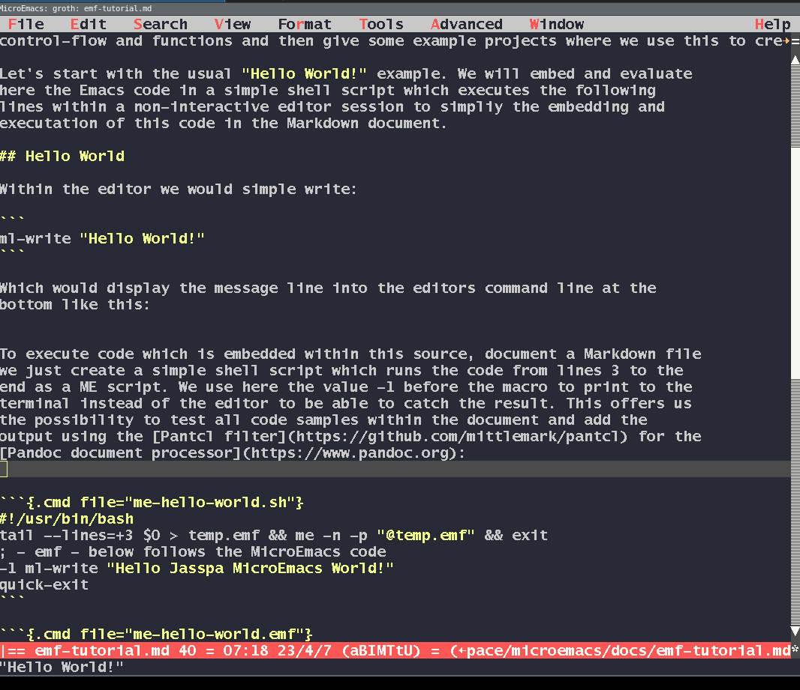

## Introduction

This is a tutorial about the [Jasspa MicroEmacs](http://www.jasspa.com)
language. We will cover the basic features of the language, variables, data
structures, control-flow and functions and then give some example projects
where we use this to create some useful extensions.

Let's start with the usual "Hello World!" example. We will embed and evaluate
here the Emacs code in a simple shell script which executes the following
lines within a non-interactive editor session to simpliy the embedding and
executation of this code in the Markdown document.

## Hello World

Within the editor we would simple execute:

```
ml-write "Hello World!"
```

That the should display the message line into the editors command line at the
bottom like this:



To execute the code which is embedded within this source document, a Markdown file,
we just create a simple shell script which runs the code from lines 3 to the
end as a ME script. We use here the value -1 before the macro to print to the
terminal instead of the editor to be able to catch the result. This offers us
the possibility to test all code samples within the document and add the
output using the [Pantcl filter](https://github.com/mittlemark/pantcl) for the
[Pandoc document processor](https://www.pandoc.org):


```{.cmd file="me-hello-world.sh"}
#!/usr/bin/bash
tail --lines=+3 $0 > temp.emf && me -n -p "@temp.emf" && exit
; - emf - below follows the MicroEmacs code
-1 ml-write "Hello Jasspa MicroEmacs World!"
quick-exit
```

This will be explained later:

```{.cmd file="me-hello-world.emf"}
#!/usr/bin/bash
tail --lines=+3 $0 > temp.emf && me -n -p "@temp.emf" && exit
; - emf - below follows the MicroEmacs code
-1 ml-write "Hello Jasspa MicroEmacs World!"
-1 ml-write &cat "This is MicroEmacs " &cat $version "!"
set-variable %x 1
!while &less %x 10
    -1 ml-write &cat "x is " %x
    set-variable %x &inc %x 1
!done
quick-exit
```

## Variables

For more background on the variables have a look at the help page [Variables](https://www.dgroth.de/me2009/me/m4fil018.htm).

Essentially we have:

- register variables - starting with the hash mark sign __#__ there are mainly used due to the fast access speed
- system variables - starting with the dollar sign __$__ and followed uppercase letters
- editor variables - starting with the dollar sign __$__ and followed by lowercase letters
- command variables - usually starting with a dot __.__ sign to be used within macros
- global variables - usually starting with a percentage __%__ sign
- buffer variables - usually starting with a colon __:__, these variables keep information about the currently opened file

Variable values were assigned usually with the `set-variable`{.emf}  command. Here an example:

```{.emf eval=true}
; make dumping out information easier
define-macro print
    -1 ml-write @1
!emacro

print "Hello Print World!"
set-variable %test "This is a test!"
set-variable #g1 "This is a global register variable!"
print %test
print #g1
; some editor variables
print $buffer-bname
print $progname
print $version
```

Every code example in this tutorial is in its own script file, so if we would like to use
the `print` macro in the next code example this would produce an error.

```{.emf eval=true}
print "test"
```

To use our print macro we will place this macro in our `user.emf` file which is in our jasspa home directory:

```{.emf eval=true}
-1 ml-write $user-path
-1 ml-write $user-name
```

So as our setting show we simply write the print macro in a file `groth.emf`.
Thereafter we should be able to use the `print` function in all code-chunk
examples. For illustrative purposes we place the function in a file
`tutorial.emf` which we put in our `$user-path` and which we then just execute
like this at the beginning of our code chunk:

```{.emf eval=true}
execute-file "tutorial.emf"
print "Hello Tutorial!"
```

Now back to variables ...

### Register variables

Global register variables start with the prefix `#g` and then a number between
1 and 9. There are used for fast access of variables values which are visible in all code regions:

```{.emf eval=true}
execute-file "tutorial.emf"
set-variable #g1 "Value of #g1 is a string!"
set-variable #g2 "Another value!"
define-macro test-global
    print #g1
!emacro 
test-global
print #g2
```

Local variable a prefixed with `#l` and the values again from 1 to 9.

Here an example:

```{.emf eval=true}
execute-file "tutorial.emf"
define-macro test-local
    set-variable #l1 "Local variable string!"
    print #l1
!emacro 
test-local
set-variable %test &spr "#l1 is '%s'" #l1
print %test
```

As you can see the default value for register variables is an empty string.

There are as well register variables with the prefix `#p` which means that the should be as well visible in the calling macro, so the parent macro.
Here an example:

```{.emf eval=true}
execute-file "tutorial.emf"
define-macro child-mac
    ; set a local variable in the caller
    set-variable #p1 "Hello parent!"
!emacro
define-macro parent-mac
    child-mac
    print #l1
!emacro
parent-mac
```

This might be helpful in some situations but might as well complicate a little bit the code
understanding.

### System variables 


As told system variables start with a dollar and they keep information about
the editor and some variables which are derived from system variables. You can
display the variables using the macro "list-variables" from within the editor,
so executing `esc-x` and then writing the command. Or by using the default
key-combination `C-h v`. Here we just display a few of these variables:

```{.emf eval=true}
execute-file "tutorial.emf"
print &sprintf "variable: $auto-time    = %s" $auto-time  
print &sprintf "variable: $buffer-bname = %s" $buffer-bname
print &sprintf "variable: $not-existing = %s" $not-existing
; load a file into MicroEmacs
find-file &cat $user-home "/groth.emf"
print &sprintf "variable: $buffer-bname = %s" $buffer-bname
; how many lines has this file
print &sprintf "variable: $window-eline = %s" $window-eline

```

As you can see in the case you try to access a variable that does not exists
you get the value "ERROR" as a variable value, that can be used to check if a
variable exists. Here an example:

```{.emf eval=true}
execute-file "tutorial.emf"
set-variable %real-var "hello"
set-variable #l2 %real-var
set-variable #l3 %dummy-var
; check if the variable has the string ERROR &seq == string equal
!if &seq #l2 "ERROR"
    print "variable %real-var does not exists!"
!else
    print "variable %real-var does exists!"
!endif
!if &seq #l3 "ERROR"
    print "variable %dummy-var does not exists!"
!else
    print "variable %dummy-var does exists!"
!endif
```


## Data structures

- scalars
- list

## Operators and Functions

- boolean
- math
- string

## Control-Flow

- if, elseif, else
- while, until

## Functions - Macros

- define-macro
- define-help

## Document generation

Thsi document was generated using pandoc and the pantcl filter like this:

```
pandoc --filter pantcl emf-tutorial.md -o temp.html -s --css mini.css
htmlark temp.html -o emf-tutorial.html
rm temp.html
```


